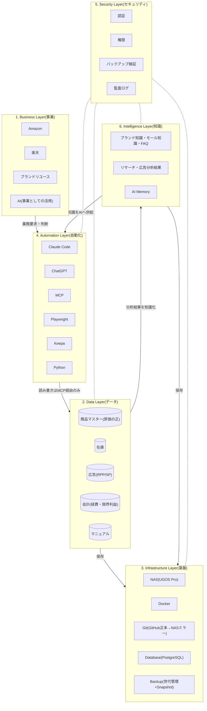

# Architecture.md — MomijiStore OS 1.0 会社全体設計図

ステータス: **v0.3 — 承認済み(2026-08-05 エース最終レビュー99点・修正6件反映)**
作成日: 2026-08-05

> **MomijiStore Philosophy**(PROJECT_CHARTER.md 第0章)
> 会社ではなく、会社を動かすOSを作る。AIが運営できる会社を作る。人ではなく、仕組みで利益が出る会社を目指す。
>
> **Rule:** フォルダ構成は設計の結果であり、目的ではない。フォルダは本設計図の確定後、最後に作る。

---

## 全体像 — 6層アーキテクチャ



**動作原理:** 人はBusiness Layerで**判断**する。AIはAutomation Layerで**仕事**をする。データはData Layerに**一元化**され、知識はIntelligence Layerに**蓄積**され、Infrastructure Layer(NAS)に**集約**される。すべての変更はGitで**追跡**される。

---

## 1. Business Layer(事業層)

「何で利益を出すか」の層。ここだけが人の判断領域。

| 事業 | 現状 | OS化された姿(目標) |
|------|------|---------------------|
| Amazon | SP広告運用・在庫連携(手動CSV) | 広告データ自動取得 → AIが分析・提案 → 人が承認 |
| 楽天 | RPP広告・KPI管理シート・月次確定運用 | 同上+在庫/価格の自動反映 |
| ブランドリユース | 立ち上げ前(03_BrandReuse ほぼ空) | 仕入判断をKeepa+AIリサーチで支援 |
| AI | 開発支援として利用中 | 事業運営の実行主体へ(人は判断のみ) |

**この層の設計ルール:** 事業が増えても(メルカリ等)、下の層は変更不要であること。事業の追加=Data Layerへのデータソース追加として扱う。

## 2. Data Layer(データ層)

会社の「事実」の層。**すべてのデータには「正(マスター)」を1つだけ定める。**

| データ | 正(現在) | 正(移行後) | 移行方針 |
|--------|-----------|-------------|----------|
| 商品マスター | Excel(商品マスターシート・原価の正) | PostgreSQL `products` | 列名・内部管理IDを変えずに移植(GS移行方針と同じ原則) |
| 在庫 | 在庫管理システムv1.0.xlsm ※**正本はPhase2の論理設計で確定する**(本番用xlsmの扱いも同時に再判断) | PostgreSQL `inventory` | 楽天=管理番号×SKUペアで照合する現行ルールを維持 |
| 広告 | 楽天RPP/AmazonSP分析シート | PostgreSQL `ads_*` | モールCSV→取込の現行パイプラインをPythonジョブ化 |
| 会計 | 月次KPIシート(経費・限界利益) | PostgreSQL `finance_*` | 月次確定の運用(黄色塗り→確定)をステータス列で再現 |
| マニュアル | 04_Manual(Markdown/Excel) | Git管理のMarkdown | すでにGit管理下。継続 |

**この層の設計ルール:**
- **データはNASへ保存する。ただし実行環境はMac・Docker・AIなど最適な場所を選択する。**(保存場所と実行場所を分けて考える — 保存先は集約、実行先は適材適所)
- AIも人も、データへのアクセスは**MCP経由に統一**する(直接DBを触る経路を作らない)
- Excel→DB移行中は「正」の所在を必ず本書に明記し、二重更新を禁止する

## 3. Infrastructure Layer(基盤層)

データと実行環境を支える層。**「1つのComposeファイル+1つのGitリポジトリで会社を再現できる」**が完成条件。

| 要素 | 役割 | 設計 |
|------|------|------|
| NAS(UGOS Pro・192.168.0.8) | 会社資産の集約先 | 共有はSMB(LAN内のみ)。外部公開しない |
| Docker | 実行基盤 | Compose 1ファイル(`momiji-stack.yml`)で全サービス定義。常駐は最小(PostgreSQL+MCP)、他はジョブ型 |
| Git | 変更の追跡 | Mac(作業)→ GitHub(正本)→ NASミラー(災害対策) |
| Database | PostgreSQL(単一インスタンス) | Redisはキューが必要になるまで導入しない(シンプル原則) |
| Backup & Disaster Recovery | 事業継続計画(BCP) | 下記参照 |

### Backup & Disaster Recovery(BCP)

「バックアップを取ること」ではなく「**事業を継続できること**」を目的として設計する。

| 手段 | 役割 |
|------|------|
| NAS Snapshot | 誤操作・ランサムウェアからの時点復元 |
| GitHub | コード・設計書・履歴の正本(NAS/Mac喪失時の復元元) |
| NAS Mirror | GitHub喪失時の完全複製(災害対策) |
| Cloud Backup(将来) | 火災・盗難等でNASごと失う場合に備えた遠隔第2バックアップ |
| **復元手順** | `90_System/` に文書化し、**年1回以上リストア訓練で検証する**(復元できないバックアップはバックアップではない) |

## 4. Automation Layer(自動化層)

AIが仕事をする層。**Data Layerへの読み書きは必ずMCPを通す。**

| ツール | 役割 | 実行場所 |
|--------|------|----------|
| Claude Code | 開発+定期ジョブ実行(集計・還流・レポート生成) | 開発=Mac / ジョブ=NAS Docker(Phase4) |
| ChatGPT | 経営壁打ち・レビュー(エース) | クラウド(人が使用) |
| MCP | データアクセスの唯一の入口 | NAS Docker常駐 |
| Playwright | ブラウザ自動化(モール画面操作・データ取得) | NAS Dockerジョブ型 |
| Keepa | Amazon価格・ランキングリサーチ(外部API) | python-workerから呼び出し |
| Python | 取込・同期・集計スクリプト(sync_cost_master.py等の移植先) | NAS Dockerジョブ型 |

### Automation Rule(基本フロー)

AIのすべての作業は次のフローに従う:

```
読む → 分析する → 提案する → 承認待ち → 実行する → Gitへ記録する
```

**承認無しの実行は禁止。** これは運用ルールではなく、システムの構造として組み込む(承認ステップを飛ばせるジョブを作らない)。

**この層の設計ルール:**
- ジョブの実行記録はSecurity Layerの監査ログに残す
- AIはIntelligence Layerの知識を参照して分析・提案の質を上げ、結果を再びIntelligence Layerへ蓄積する

## 5. Security Layer(セキュリティ層)

全層を横断する層。

| 要素 | 方針 |
|------|------|
| 認証 | NAS認証情報・APIキーは平文でリポジトリに置かない。Docker secretsで管理(Phase4で設計)。認証情報の入力は人が行う |
| 権限 | 最小権限。共有フォルダ・DBユーザーは役割単位(admin / automation / readonly) |
| バックアップ | 取得だけでなく**復元テストまで**をセキュリティ要件とする(年1回以上のリストア訓練) |
| 監査ログ | 自動化ジョブの実行ログ・DB変更履歴・Gitコミット履歴の3点で「誰(何)がいつ何を変えたか」を追跡可能にする |

## 6. Intelligence Layer(知識層)

会社全体の知識を蓄積する層。**AIが学習する会社の知識基盤**を作る。Business Layer(事業の判断)とは分離する — 事業は変わっても知識は蓄積され続ける。

| 知識 | 内容 | 供給元 |
|------|------|--------|
| 商品マスター知識 | 商品・原価・仕入の知識としての参照(※データの「正」はData Layer。二重管理しない) | Data Layer |
| ブランド知識 | ブランドリユースの真贋・相場・仕入判断基準 | リサーチ+人の判断の蓄積 |
| Keepaデータ | Amazon価格・ランキング履歴 | Keepa API |
| Amazon知識 | SP広告・出品・規約のノウハウ | 運用+分析結果 |
| 楽天知識 | RPP広告・SKU運用・月次確定のノウハウ | 運用+分析結果 |
| 広告分析結果 | RPP/SP分析の結論・採用した施策と結果 | Automation Layer |
| リサーチ結果 | 商品リサーチ・市場調査の蓄積 | Automation Layer |
| FAQ | 顧客対応・社内手順のQ&A | 運用 |
| マニュアル | 04_Manual(操作・運用手順) | Git管理Markdown |
| AI Memory | Claude/AIエージェントの長期記憶 | Automation Layer |

**この層の設計ルール:**
- 知識はAIが読める形式(Markdown/構造化データ)で蓄積する — 人の頭の中に置かない
- 分析・施策の「結論と結果」を必ず書き戻す(やりっぱなし禁止)。これがAI提案の質を上げる学習ループになる

### AI Memory Policy(Intelligence Layerの運用ルール)

| 項目 | ルール |
|------|--------|
| **保存する情報** | 事業判断の基準と結果(なぜ仕入れた/やめたか)・施策の結論と成果・運用ノウハウ(モール仕様の罠等)・ユーザーからの訂正/フィードバック・設計判断(Decision Log) |
| **保存しない情報** | 認証情報・APIキー(平文禁止)・顧客の個人情報・一時的な会話内容・Gitやデータから再導出できる事実(コード構造・数値そのもの)・根拠のない推測 |
| **更新ルール** | 同じテーマの知識は新規追加ではなく既存を更新する(重複を作らない)。誤りと判明した知識は削除し、削除理由をDecision Logに残す |
| **知識の寿命** | すべての知識に記録日を付ける。モール仕様・広告ノウハウ等の外部依存知識は**1年で要再確認**扱い。事業判断基準は無期限(ただしレビュー対象) |
| **レビュー方法** | **四半期に1回**、AIが知識全体を棚卸しする(重複統合・期限切れ確認・矛盾検出)。結果を人がレビューして確定する |

---

## フォルダ構成について

**本設計図の承認後に、この6層の結果として設計する**(Rule準拠)。
現時点の方向性のみ記す: NAS共有フォルダはData/Intelligence/Infrastructure Layerの写像(Git・Backup・Data・Knowledge・AIModels・System)とし、Phase2で承認を得てから作成する。

---

## Naming Convention(命名規則)

**目的: 命名揺れを無くす。** ここに無いものを命名する時は、まず本章に規則を追加してから命名する。

| 対象 | 規則 | 例 |
|------|------|-----|
| 共有フォルダ | 番号プレフィックス2桁 + 英語PascalCase。番号は10刻み(挿入余地) | `10_Git/` `20_Backup/` `30_Data/` `40_Knowledge/` `50_AIModels/` `90_System/` |
| Docker(サービス/コンテナ) | `momiji-` プレフィックス + 小文字ケバブケース | `momiji-postgres` `momiji-mcp` `momiji-python-worker` |
| Docker(ボリューム/ネットワーク) | `momiji_` プレフィックス + スネークケース | `momiji_pg_data` `momiji_net` |
| Dockerイメージ | バージョンタグを必ず固定(`latest` 禁止) | `postgres:16.4` |
| Git(ブランチ) | `main` + 作業ブランチは `feature/内容` `fix/内容`(英語) | `feature/pg-migration` |
| Git(コミット) | 日本語1行要約 — 「何をしたか + 主要な数値/結果」(現行慣行を継続) | `楽天7月が全項目確定 — 経費入力済み` |
| Database(テーブル) | 小文字スネークケース・複数形。列名は既存Excel列と対応表を維持 | `products` `inventory_items` `ads_rakuten_rpp` |
| 環境変数 | `MOMIJI_` プレフィックス + 大文字スネークケース | `MOMIJI_DB_HOST` `MOMIJI_KEEPA_KEY` |
| ログ | `ジョブ名_YYYYMMDD.log`。ジョブ名は英語スネークケース | `sync_cost_master_20260805.log` |
| バックアップ | `名前_backup_YYYYMMDD_内容`(既存規則を継続)。`Backup/` フォルダへ集約 | `Module_Inventory_backup_20260805_pre_dbmigration.bas` |
| ドキュメント | 英語ファイル名・大文字スネークまたはPascal(既存踏襲)。日本語は本文のみ | `PROJECT_CHARTER.md` `NAS_PHASE1_SURVEY_REPORT.md` |

※ import対象のモール由来CSVのファイル名は**変更しない**(照合互換のため — 既存ルール)。

---

## Decision Log(設計判断の記録)

**目的: AIが「なぜこの設計なのか」を理解できるようにする。** 新しい判断は本表の先頭に追記する。

| 日時 | 決定事項 | 理由 | 代替案 | 採用理由 | 影響範囲 |
|------|----------|------|--------|----------|----------|
| 2026-08-05 | **MacからNASへのSMB接続は正常。Finder / CLI / Claude Code すべてが同一SMBセッションを利用できることを確認** | 実機検証で `//momiji-admin@192.168.0.8/MomijiStore` をSMB 3.1.1でマウントし、`mount`・`smbutil statshares`・`smbutil view` から同一セッションを確認。当初の「445 closed」はNAS側SMBサービスが未稼働だった時点の観測であり、Mac側・Claude Code側の制約ではないと判明(445と139が同時に開き、無関係な22/9999は不変) | Finder専用運用とし自動化はNASローカルで完結させる | Mac・CLI・AIが同じ経路でNASを扱えるため、設計を分岐させずに済む | **今後はNASを中心としたMomijiStore OS構築を進める。** Phase2以降の全設計の前提 |
| 2026-08-05 | Phase番号はArchitecture.md Roadmapを正とする | 憲章と本書で番号が不一致だった | 憲章を正とする | Roadmapが最新の全体像を反映しているため | 憲章§7・全ドキュメントのPhase表記 |
| 2026-08-05 | 商品マスターの「正」はData Layerに置き、Intelligence Layerは知識として参照 | 「正を1つだけ定める」原則との二重管理を防ぐ | Intelligence Layerにも実体を置く | 二重更新事故を構造的に排除できる | Data/Intelligence Layer設計 |
| 2026-08-05 | Redisは導入保留 | 現規模ではPostgreSQLでキュー相当を賄える | 最初からRedis導入 | Always Simple原則(必要になった時だけ追加) | Phase3 Compose構成 |
| 2026-08-05 | Git: Mac→GitHub(正本)→NAS Mirror(災害対策) | GitHubの利便性維持+会社資産の完全複製 | NASを正本にする/NAS作業ツリー | GitHub機能(PR/Release)と売却時の見せやすさ。SMB越しgitは破損リスク | Git運用全体 |
| 2026-08-05 | Git ServerはbareミラーとしGiteaは導入しない | 正本はGitHubであり、NASには複製があれば足りる | Giteaコンテナ | 運用対象を増やさない(Always Simple) | Phase3実装 |
| 2026-08-05 | 常駐コンテナはPostgreSQL+MCPのみ、他はジョブ型 | NASのCPU/RAM制約とシンプル運用 | 全サービス常駐 | リソース節約・障害点削減 | Phase3以降の運用 |
| 2026-08-05 | 本番用xlsm(`在庫管理システム_v1.0_本番用.xlsm`)は**保留継続。Phase2で「在庫管理システムの正本」を確定した時点で再判断する** | git履歴に残っており復元可能。現行 `在庫管理システム_v1.0.xlsm` とは別ファイルで、今復元すると正本が二重化する可能性がある。一方で削除確定も早い | 即時復元 / 削除確定 | 正本が未確定な段階でどちらに倒しても事故になるため、正本確定を待つのが最も安全 | 在庫管理Excel運用。**再判断まで復元・削除・移動・リネーム・上書きをすべて禁止** |

---

## Change Management(変更管理)

以下の変更は、**実施前に必ずDecision Logへ記録**し、承認制ルール(PROJECT_CHARTER §8)に従って承認を得てから実施する:

- 設計変更(本書・各Layerの構成)
- 構成変更(NAS共有フォルダ・ネットワーク)
- Docker変更(サービス追加/削除・イメージ更新・Compose変更)
- フォルダ変更(作成・移動・リネーム・削除)
- DB変更(スキーマ・テーブル・権限)

**フロー:** 変更提案 → Decision Log記録(代替案含む) → 承認 → バックアップ → 実施 → Gitコミット(Decision Logと実装を同一コミットに)。
記録なき変更は、たとえ良い変更でも差し戻す。

## Success Metrics

会社のOSが成長しているかを測定するKPI。Phase2以降、四半期ごとに計測する(計測方法の詳細は論理設計で定義)。

| KPI | 何を測るか |
|-----|-----------|
| AIが処理する作業割合 | 全業務のうちAIが実行した割合 |
| 人の作業時間 | 判断以外に人が使っている時間(減るほど良い) |
| 自動化率 | 定型業務のうち自動化済みの割合 |
| Git管理率 | 会社資産のうちGitで追跡されている割合 |
| バックアップ成功率 | スケジュールバックアップの成功割合 |
| 復元時間 | 障害発生から業務再開までの時間(リストア訓練で実測) |
| 商品登録時間 | 1商品あたりの登録所要時間 |
| 広告分析時間 | 月次広告分析の所要時間 |
| AI提案採用率 | AIの提案のうち人が承認した割合(提案の質の指標) |

## Roadmap

| フェーズ | テーマ | 到達点 |
|----------|--------|--------|
| Phase1 | **NAS** | 調査・接続確認 ✅ |
| Phase2 | **MomijiStore OS** | 会社OSの論理設計(本書)→ その結果としてのフォルダ・共有構築 |
| Phase3 | **Docker** | NAS上の実行基盤(Compose 1ファイル化・Gitミラー・バックアップ自動化) |
| Phase4 | **Database** | Excel→PostgreSQL移行(商品マスター・在庫・広告・会計) |
| Phase5 | **AI Agent** | MCP経由でAIが業務を実行(Automation Rule準拠) |
| Phase6 | **Autonomous Company** | 人は判断のみ。仕組みで利益が出る会社 |

## 未確定事項(Phase2開始条件と対応)

| 項目 | 状態 |
|------|------|
| SMB確認 | ✅ 完了(2026-08-05 実機確認 — SMB 3.1.1で共有`MomijiStore`をマウント成功) |
| RAM容量確認 | ⬜ 確認待ち(Ollama実用サイズの再評価に必要) |
| RAID確認 | ⬜ 構成・Volume・空きベイの確認待ち |
| **NAS永続マウント方式** | ⬜ 決定待ち(Finder / launchd / autofs 等)。バックグラウンドジョブからマウントが見えるかに直結するため、Phase3の自動化方式を左右する |
| Phase番号統一 | ✅ 完了(本書Roadmapを正とし、憲章v0.6を統一済み) |
| 本番用xlsmの扱い | ✅ **保留継続を決定**(2026-08-05)。Phase2で「在庫管理システムの正本」を確定した時点で再判断する。それまで復元・削除・移動・リネーム・上書きをすべて禁止 |

---

## Definition of Done — MomijiStore OS 1.0 完成条件

**目的: ゴールを明確にする。** 以下がすべて満たされた時、MomijiStore OS 1.0は「完成」とする。

| # | 完成条件 | 検証方法 |
|---|----------|----------|
| 1 | AIだけで商品分析ができる | 人の操作なしで分析レポートが生成され、人は承認のみ |
| 2 | AIだけで広告分析ができる | RPP/SP月次分析がジョブで自動生成される |
| 3 | AIが商品マスターを更新できる(承認フロー付き) | Automation Rule(提案→承認→実行→Git記録)で更新が完結する |
| 4 | Git管理率100% | 会社の資産(コード・設計・知識・マニュアル)がすべてGit追跡下にある |
| 5 | バックアップが自動化されている | 人が何もしなくてもスケジュールで取得され、成功率がKPIで見える |
| 6 | 復元テストに成功している | リストア訓練で「NAS喪失→復旧」を実測時間付きで実証済み |
| 7 | **人が変わっても運営できる** | 本書+マニュアル+復旧手順だけで、第三者が運営を引き継げる(売却可能状態) |

この7条件はSuccess Metricsで継続測定し、達成した瞬間ではなく**維持できていること**をもって完成とする。
