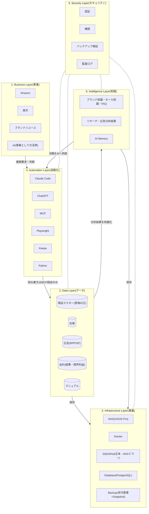

# Architecture.md — MomijiStore OS 1.0 会社全体設計図

ステータス: **v0.2 — 承認済み(2026-08-05 エースレビュー98点・修正6件反映)**
作成日: 2026-08-05

> **MomijiStore Philosophy**(PROJECT_CHARTER.md 第0章)
> 会社ではなく、会社を動かすOSを作る。AIが運営できる会社を作る。人ではなく、仕組みで利益が出る会社を目指す。
>
> **Rule:** フォルダ構成は設計の結果であり、目的ではない。フォルダは本設計図の確定後、最後に作る。

---

## 全体像 — 6層アーキテクチャ



**動作原理:** 人はBusiness Layerで**判断**する。AIはAutomation Layerで**仕事**をする。データはData Layerに**一元化**され、知識はIntelligence Layerに**蓄積**され、Infrastructure Layer(NAS)に**集約**される。すべての変更はGitで**追跡**される。

---

## 1. Business Layer(事業層)

「何で利益を出すか」の層。ここだけが人の判断領域。

| 事業 | 現状 | OS化された姿(目標) |
|------|------|---------------------|
| Amazon | SP広告運用・在庫連携(手動CSV) | 広告データ自動取得 → AIが分析・提案 → 人が承認 |
| 楽天 | RPP広告・KPI管理シート・月次確定運用 | 同上+在庫/価格の自動反映 |
| ブランドリユース | 立ち上げ前(03_BrandReuse ほぼ空) | 仕入判断をKeepa+AIリサーチで支援 |
| AI | 開発支援として利用中 | 事業運営の実行主体へ(人は判断のみ) |

**この層の設計ルール:** 事業が増えても(メルカリ等)、下の層は変更不要であること。事業の追加=Data Layerへのデータソース追加として扱う。

## 2. Data Layer(データ層)

会社の「事実」の層。**すべてのデータには「正(マスター)」を1つだけ定める。**

| データ | 正(現在) | 正(移行後) | 移行方針 |
|--------|-----------|-------------|----------|
| 商品マスター | Excel(商品マスターシート・原価の正) | PostgreSQL `products` | 列名・内部管理IDを変えずに移植(GS移行方針と同じ原則) |
| 在庫 | 在庫管理システムv1.0.xlsm | PostgreSQL `inventory` | 楽天=管理番号×SKUペアで照合する現行ルールを維持 |
| 広告 | 楽天RPP/AmazonSP分析シート | PostgreSQL `ads_*` | モールCSV→取込の現行パイプラインをPythonジョブ化 |
| 会計 | 月次KPIシート(経費・限界利益) | PostgreSQL `finance_*` | 月次確定の運用(黄色塗り→確定)をステータス列で再現 |
| マニュアル | 04_Manual(Markdown/Excel) | Git管理のMarkdown | すでにGit管理下。継続 |

**この層の設計ルール:**
- AIも人も、データへのアクセスは**MCP経由に統一**する(直接DBを触る経路を作らない)
- Excel→DB移行中は「正」の所在を必ず本書に明記し、二重更新を禁止する

## 3. Infrastructure Layer(基盤層)

データと実行環境を支える層。**「1つのComposeファイル+1つのGitリポジトリで会社を再現できる」**が完成条件。

| 要素 | 役割 | 設計 |
|------|------|------|
| NAS(UGOS Pro・192.168.0.8) | 会社資産の集約先 | 共有はSMB(LAN内のみ)。外部公開しない |
| Docker | 実行基盤 | Compose 1ファイル(`momiji-stack.yml`)で全サービス定義。常駐は最小(PostgreSQL+MCP)、他はジョブ型 |
| Git | 変更の追跡 | Mac(作業)→ GitHub(正本)→ NASミラー(災害対策) |
| Database | PostgreSQL(単一インスタンス) | Redisはキューが必要になるまで導入しない(シンプル原則) |
| Backup & Disaster Recovery | 事業継続計画(BCP) | 下記参照 |

### Backup & Disaster Recovery(BCP)

「バックアップを取ること」ではなく「**事業を継続できること**」を目的として設計する。

| 手段 | 役割 |
|------|------|
| NAS Snapshot | 誤操作・ランサムウェアからの時点復元 |
| GitHub | コード・設計書・履歴の正本(NAS/Mac喪失時の復元元) |
| NAS Mirror | GitHub喪失時の完全複製(災害対策) |
| Cloud Backup(将来) | 火災・盗難等でNASごと失う場合に備えた遠隔第2バックアップ |
| **復元手順** | `90_System/` に文書化し、**年1回以上リストア訓練で検証する**(復元できないバックアップはバックアップではない) |

## 4. Automation Layer(自動化層)

AIが仕事をする層。**Data Layerへの読み書きは必ずMCPを通す。**

| ツール | 役割 | 実行場所 |
|--------|------|----------|
| Claude Code | 開発+定期ジョブ実行(集計・還流・レポート生成) | 開発=Mac / ジョブ=NAS Docker(Phase4) |
| ChatGPT | 経営壁打ち・レビュー(エース) | クラウド(人が使用) |
| MCP | データアクセスの唯一の入口 | NAS Docker常駐 |
| Playwright | ブラウザ自動化(モール画面操作・データ取得) | NAS Dockerジョブ型 |
| Keepa | Amazon価格・ランキングリサーチ(外部API) | python-workerから呼び出し |
| Python | 取込・同期・集計スクリプト(sync_cost_master.py等の移植先) | NAS Dockerジョブ型 |

### Automation Rule(基本フロー)

AIのすべての作業は次のフローに従う:

```
読む → 分析する → 提案する → 承認待ち → 実行する → Gitへ記録する
```

**承認無しの実行は禁止。** これは運用ルールではなく、システムの構造として組み込む(承認ステップを飛ばせるジョブを作らない)。

**この層の設計ルール:**
- ジョブの実行記録はSecurity Layerの監査ログに残す
- AIはIntelligence Layerの知識を参照して分析・提案の質を上げ、結果を再びIntelligence Layerへ蓄積する

## 5. Security Layer(セキュリティ層)

全層を横断する層。

| 要素 | 方針 |
|------|------|
| 認証 | NAS認証情報・APIキーは平文でリポジトリに置かない。Docker secretsで管理(Phase4で設計)。認証情報の入力は人が行う |
| 権限 | 最小権限。共有フォルダ・DBユーザーは役割単位(admin / automation / readonly) |
| バックアップ | 取得だけでなく**復元テストまで**をセキュリティ要件とする(年1回以上のリストア訓練) |
| 監査ログ | 自動化ジョブの実行ログ・DB変更履歴・Gitコミット履歴の3点で「誰(何)がいつ何を変えたか」を追跡可能にする |

## 6. Intelligence Layer(知識層)

会社全体の知識を蓄積する層。**AIが学習する会社の知識基盤**を作る。Business Layer(事業の判断)とは分離する — 事業は変わっても知識は蓄積され続ける。

| 知識 | 内容 | 供給元 |
|------|------|--------|
| 商品マスター知識 | 商品・原価・仕入の知識としての参照(※データの「正」はData Layer。二重管理しない) | Data Layer |
| ブランド知識 | ブランドリユースの真贋・相場・仕入判断基準 | リサーチ+人の判断の蓄積 |
| Keepaデータ | Amazon価格・ランキング履歴 | Keepa API |
| Amazon知識 | SP広告・出品・規約のノウハウ | 運用+分析結果 |
| 楽天知識 | RPP広告・SKU運用・月次確定のノウハウ | 運用+分析結果 |
| 広告分析結果 | RPP/SP分析の結論・採用した施策と結果 | Automation Layer |
| リサーチ結果 | 商品リサーチ・市場調査の蓄積 | Automation Layer |
| FAQ | 顧客対応・社内手順のQ&A | 運用 |
| マニュアル | 04_Manual(操作・運用手順) | Git管理Markdown |
| AI Memory | Claude/AIエージェントの長期記憶 | Automation Layer |

**この層の設計ルール:**
- 知識はAIが読める形式(Markdown/構造化データ)で蓄積する — 人の頭の中に置かない
- 分析・施策の「結論と結果」を必ず書き戻す(やりっぱなし禁止)。これがAI提案の質を上げる学習ループになる

---

## フォルダ構成について

**本設計図の承認後に、この5層の結果として設計する**(Rule準拠)。
現時点の方向性のみ記す: NAS共有フォルダはData/Infrastructure Layerの写像(Git・Backup・Data・AIModels・System)とし、Phase2で承認を得てから作成する。

## Success Metrics

会社のOSが成長しているかを測定するKPI。Phase2以降、四半期ごとに計測する(計測方法の詳細は論理設計で定義)。

| KPI | 何を測るか |
|-----|-----------|
| AIが処理する作業割合 | 全業務のうちAIが実行した割合 |
| 人の作業時間 | 判断以外に人が使っている時間(減るほど良い) |
| 自動化率 | 定型業務のうち自動化済みの割合 |
| Git管理率 | 会社資産のうちGitで追跡されている割合 |
| バックアップ成功率 | スケジュールバックアップの成功割合 |
| 復元時間 | 障害発生から業務再開までの時間(リストア訓練で実測) |
| 商品登録時間 | 1商品あたりの登録所要時間 |
| 広告分析時間 | 月次広告分析の所要時間 |
| AI提案採用率 | AIの提案のうち人が承認した割合(提案の質の指標) |

## Roadmap

| フェーズ | テーマ | 到達点 |
|----------|--------|--------|
| Phase1 | **NAS** | 調査・接続確認 ✅ |
| Phase2 | **MomijiStore OS** | 会社OSの論理設計(本書)→ その結果としてのフォルダ・共有構築 |
| Phase3 | **Docker** | NAS上の実行基盤(Compose 1ファイル化・Gitミラー・バックアップ自動化) |
| Phase4 | **Database** | Excel→PostgreSQL移行(商品マスター・在庫・広告・会計) |
| Phase5 | **AI Agent** | MCP経由でAIが業務を実行(Automation Rule準拠) |
| Phase6 | **Autonomous Company** | 人は判断のみ。仕組みで利益が出る会社 |

## 未確定事項(Phase2開始条件と対応)

| 項目 | 状態 |
|------|------|
| 本書の承認 | ✅ 承認済み(エースレビュー98点・修正6件反映済み) |
| SMB確認 | ⬜ 管理画面での原因特定・開通(ユーザー操作) |
| RAM容量確認 | ⬜ 確認待ち(Ollama実用サイズの再評価に必要) |
| RAID確認 | ⬜ 構成・Volume・空きベイの確認待ち |
