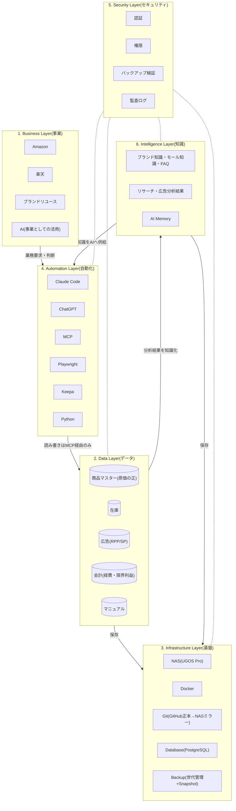

# Architecture.md — MomijiStore OS 1.0 会社全体設計図

> **This document follows FOUNDATION.md.**
> **If any conflict exists, FOUNDATION.md takes precedence.**

ステータス: **v0.4 — 承認済み(2026-08-05)**
作成日: 2026-08-05(v0.4 — FOUNDATION.md優先宣言を追加)

> **MomijiStore Philosophy**(PROJECT_CHARTER.md 第0章)
> 会社ではなく、会社を動かすOSを作る。AIが運営できる会社を作る。人ではなく、仕組みで利益が出る会社を目指す。
>
> **Rule:** フォルダ構成は設計の結果であり、目的ではない。フォルダは本設計図の確定後、最後に作る。

---

## 全体像 — 6層アーキテクチャ



**動作原理:** 人はBusiness Layerで**判断**する。AIはAutomation Layerで**仕事**をする。データはData Layerに**一元化**され、知識はIntelligence Layerに**蓄積**され、Infrastructure Layer(NAS)に**集約**される。すべての変更はGitで**追跡**される。

---

## 1. Business Layer(事業層)

「何で利益を出すか」の層。ここだけが人の判断領域。

| 事業 | 現状 | OS化された姿(目標) |
|------|------|---------------------|
| Amazon | SP広告運用・在庫連携(手動CSV) | 広告データ自動取得 → AIが分析・提案 → 人が承認 |
| 楽天 | RPP広告・KPI管理シート・月次確定運用 | 同上+在庫/価格の自動反映 |
| ブランドリユース | 立ち上げ前(03_BrandReuse ほぼ空) | 仕入判断をKeepa+AIリサーチで支援 |
| AI | 開発支援として利用中 | 事業運営の実行主体へ(人は判断のみ) |

**この層の設計ルール:** 事業が増えても(メルカリ等)、下の層は変更不要であること。事業の追加=Data Layerへのデータソース追加として扱う。

## 2. Data Layer(データ層)

会社の「事実」の層。**すべてのデータには「正(マスター)」を1つだけ定める。**

| データ | 正(現在) | 正(移行後) | 移行方針 |
|--------|-----------|-------------|----------|
| 商品マスター | Excel(商品マスターシート・原価の正) | PostgreSQL `products` | 列名・内部管理IDを変えずに移植(GS移行方針と同じ原則) |
| 在庫 | **`SourceData/在庫管理テーブル_v1.1.xlsm`**(2026-08-11確定・554件) | PostgreSQL `inventory` | 楽天=管理番号×SKUペアで照合する現行ルールを維持 |
| 広告 | 楽天RPP/AmazonSP分析シート | PostgreSQL `ads_*` | モールCSV→取込の現行パイプラインをPythonジョブ化 |
| 会計 | 月次KPIシート(経費・限界利益) | PostgreSQL `finance_*` | 月次確定の運用(黄色塗り→確定)をステータス列で再現 |
| マニュアル | 04_Manual(Markdown/Excel) | Git管理のMarkdown | すでにGit管理下。継続 |

**この層の設計ルール:**
- **データはNASへ保存する。ただし実行環境はMac・Docker・AIなど最適な場所を選択する。**(保存場所と実行場所を分けて考える — 保存先は集約、実行先は適材適所)
- AIも人も、データへのアクセスは**MCP経由に統一**する(直接DBを触る経路を作らない)
- Excel→DB移行中は「正」の所在を必ず本書に明記し、二重更新を禁止する

## 3. Infrastructure Layer(基盤層)

データと実行環境を支える層。**「1つのComposeファイル+1つのGitリポジトリで会社を再現できる」**が完成条件。

| 要素 | 役割 | 設計 |
|------|------|------|
| NAS(UGOS Pro・192.168.0.8) | 会社資産の集約先 | 共有はSMB(LAN内のみ)。外部公開しない |
| Docker | 実行基盤 | Compose 1ファイル(`momiji-stack.yml`)で全サービス定義。常駐は最小(PostgreSQL+MCP)、他はジョブ型 |
| Git | 変更の追跡 | Mac(作業)→ GitHub(正本)→ NASミラー(災害対策) |
| Database | PostgreSQL(単一インスタンス) | Redisはキューが必要になるまで導入しない(シンプル原則) |
| Backup & Disaster Recovery | 事業継続計画(BCP) | 下記参照 |

### Backup & Disaster Recovery(BCP)

「バックアップを取ること」ではなく「**事業を継続できること**」を目的として設計する。

| 手段 | 役割 |
|------|------|
| NAS Snapshot | 誤操作・ランサムウェアからの時点復元 |
| GitHub | コード・設計書・履歴の正本(NAS/Mac喪失時の復元元) |
| NAS Mirror | GitHub喪失時の完全複製(災害対策) |
| Cloud Backup(将来) | 火災・盗難等でNASごと失う場合に備えた遠隔第2バックアップ |
| **復元手順** | `90_System/` に文書化し、**年1回以上リストア訓練で検証する**(復元できないバックアップはバックアップではない) |

## 4. Automation Layer(自動化層)

AIが仕事をする層。**Data Layerへの読み書きは必ずMCPを通す。**

| ツール | 役割 | 実行場所 |
|--------|------|----------|
| Claude Code | 開発+定期ジョブ実行(集計・還流・レポート生成) | 開発=Mac / ジョブ=NAS Docker(Phase4) |
| ChatGPT | 経営壁打ち・レビュー(エース) | クラウド(人が使用) |
| MCP | データアクセスの唯一の入口 | NAS Docker常駐 |
| Playwright | ブラウザ自動化(モール画面操作・データ取得) | NAS Dockerジョブ型 |
| Keepa | Amazon価格・ランキングリサーチ(外部API) | python-workerから呼び出し |
| Python | 取込・同期・集計スクリプト(sync_cost_master.py等の移植先) | NAS Dockerジョブ型 |

### Automation Rule(基本フロー)

AIのすべての作業は次のフローに従う:

```
読む → 分析する → 提案する → 承認待ち → 実行する → Gitへ記録する
```

**承認無しの実行は禁止。** これは運用ルールではなく、システムの構造として組み込む(承認ステップを飛ばせるジョブを作らない)。

**この層の設計ルール:**
- ジョブの実行記録はSecurity Layerの監査ログに残す
- AIはIntelligence Layerの知識を参照して分析・提案の質を上げ、結果を再びIntelligence Layerへ蓄積する

## 5. Security Layer(セキュリティ層)

全層を横断する層。

| 要素 | 方針 |
|------|------|
| 認証 | NAS認証情報・APIキーは平文でリポジトリに置かない。Docker secretsで管理(Phase4で設計)。認証情報の入力は人が行う |
| 権限 | 最小権限。共有フォルダ・DBユーザーは役割単位(admin / automation / readonly) |
| バックアップ | 取得だけでなく**復元テストまで**をセキュリティ要件とする(年1回以上のリストア訓練) |
| 監査ログ | 自動化ジョブの実行ログ・DB変更履歴・Gitコミット履歴の3点で「誰(何)がいつ何を変えたか」を追跡可能にする |

## 6. Intelligence Layer(知識層)

会社全体の知識を蓄積する層。**AIが学習する会社の知識基盤**を作る。Business Layer(事業の判断)とは分離する — 事業は変わっても知識は蓄積され続ける。

| 知識 | 内容 | 供給元 |
|------|------|--------|
| 商品マスター知識 | 商品・原価・仕入の知識としての参照(※データの「正」はData Layer。二重管理しない) | Data Layer |
| ブランド知識 | ブランドリユースの真贋・相場・仕入判断基準 | リサーチ+人の判断の蓄積 |
| Keepaデータ | Amazon価格・ランキング履歴 | Keepa API |
| Amazon知識 | SP広告・出品・規約のノウハウ | 運用+分析結果 |
| 楽天知識 | RPP広告・SKU運用・月次確定のノウハウ | 運用+分析結果 |
| 広告分析結果 | RPP/SP分析の結論・採用した施策と結果 | Automation Layer |
| リサーチ結果 | 商品リサーチ・市場調査の蓄積 | Automation Layer |
| FAQ | 顧客対応・社内手順のQ&A | 運用 |
| マニュアル | 04_Manual(操作・運用手順) | Git管理Markdown |
| AI Memory | Claude/AIエージェントの長期記憶 | Automation Layer |

**この層の設計ルール:**
- 知識はAIが読める形式(Markdown/構造化データ)で蓄積する — 人の頭の中に置かない
- 分析・施策の「結論と結果」を必ず書き戻す(やりっぱなし禁止)。これがAI提案の質を上げる学習ループになる

### 判断記録(Decision Record)— 2026-09-05 実装

**この層の中心。「何を判断し / なぜそう判断し / 結果どうなったか」を対で残す。**

分析だけではAIは成長しない。分析は「今どうなっているか」しか教えない。
**判断と結果が対で残って初めて、AIは「その判断が正しかったか」を学習できる。**

#### 構成

| 要素 | 実体 | 役割 |
|------|------|------|
| 判断の**型** | `Decision_Catalog.md`(22件) | 「DEC-SAL-02 = 価格を変更するかどうか」と語彙を定める |
| 判断の**実例** | `intelligence.decisions` | 実際に下した1件ごとの判断。`decision_type` に型のIDを入れる |
| 判断の**結果** | `intelligence.outcomes` | 後日測った結果。1判断に複数回記録してよい |
| **未検証の一覧** | `intelligence.pending_reviews`(ビュー) | 結果が未記録の判断。**やりっぱなしの可視化** |
| 記録・参照の入口 | MCPツール4種 | `record_decision` / `record_outcome` / `search_decisions` / `list_pending_reviews` |

スキーマ定義: `05_Infrastructure/db/migrations/001_intelligence_layer.sql`
適用: `05_Infrastructure/deploy/Migrate.sh`(GitHub main が正本・冪等・適用履歴をDBに残す)

#### 記録する内容

```
判断: 何を(action) / どの型か(decision_type) / 何について(subject)
      なぜ(reason) / 何を検討して採らなかったか(alternatives)
      何を期待したか(expected / expected_metric / expected_value)
      いつ結果を見るか(review_due) / 誰が決めたか(decided_by)
      誰が提案したか(proposed_by) / 根拠にしたBL(business_logic)
結果: 実績(metric / actual_value) / 評価(assessment) / 学び(learning)
```

#### 設計上の4つの決めごと

| # | 決めごと | 理由 |
|---|---------|------|
| 1 | **「変更しない」「見送る」も記録する**(`action_kind` = changed / unchanged / rejected) | BL-11。却下理由が残らないと、AIは同じ候補を繰り返し提案する。**「なぜ買ったか」より「なぜ買わなかったか」のほうが学習価値が高い** |
| 2 | **追記専用。UPDATE / DELETE を行わない** | BL-7「記録なき変更を認めない」。訂正は `supersedes` に旧IDを入れた新しい行で行う。DB側のトリガーでも拒否するため、運用の作法ではなく**構造**として守られる |
| 3 | **判断者(`decided_by`)にAIを指定できない** | AI Constitution 第1条。DBのCHECK制約とアプリの入力検証の両方で拒否する。AIの関与は `proposed_by` にのみ記録する |
| 4 | **`decision_type` は Decision_Catalog に登録済みの形式しか受け付けない** | 記録が増えても語彙が散らからないようにする。新しい種類の判断は、先にカタログへ型を追加してから記録する |

#### 「正本を増やさない」との関係(BL-5)

この2表は **Excelに対応物を持たない**。移行データではなく「DBで生まれるデータ」であり、最初からここが正本である。
そのため `momiji-stack.yml` の「Phase4完了までDBは正本ではない」という注意書きの対象外となる(対象は移行途中の業務データ)。
スキーマも `public`(Phase4の移行先)と `intelligence`(知識)で分離し、どちらが正本かが再び曖昧にならないようにしている。

#### 学習ループが回っているかの判定

**`pending_reviews` の件数が唯一の客観指標。** ここが溜まっている状態は、施策を打ちっぱなしで検証していないことを意味する。
記録時に `review_due` を設定しないと警告を返すのは、この一覧に「期限のない放置」が混ざるのを防ぐため。

### AI Memory Policy(Intelligence Layerの運用ルール)

> **This document follows FOUNDATION.md. If any conflict exists, FOUNDATION.md takes precedence.**
> ※ AI Memory Policyは独立文書ではなく本書の一節として管理する(Always Simple — 分割は必要になった時に検討する)。

| 項目 | ルール |
|------|--------|
| **保存する情報** | 事業判断の基準と結果(なぜ仕入れた/やめたか)・施策の結論と成果・運用ノウハウ(モール仕様の罠等)・ユーザーからの訂正/フィードバック・設計判断(Decision Log) |
| **保存しない情報** | 認証情報・APIキー(平文禁止)・顧客の個人情報・一時的な会話内容・Gitやデータから再導出できる事実(コード構造・数値そのもの)・根拠のない推測 |
| **更新ルール** | 同じテーマの知識は新規追加ではなく既存を更新する(重複を作らない)。誤りと判明した知識は削除し、削除理由をDecision Logに残す |
| **知識の寿命** | すべての知識に記録日を付ける。モール仕様・広告ノウハウ等の外部依存知識は**1年で要再確認**扱い。事業判断基準は無期限(ただしレビュー対象) |
| **レビュー方法** | **四半期に1回**、AIが知識全体を棚卸しする(重複統合・期限切れ確認・矛盾検出)。結果を人がレビューして確定する |

---

## フォルダ構成について

**本設計図の承認後に、この6層の結果として設計する**(Rule準拠)。
現時点の方向性のみ記す: NAS共有フォルダはData/Intelligence/Infrastructure Layerの写像(Git・Backup・Data・Knowledge・AIModels・System)とし、Phase2で承認を得てから作成する。

---

## Naming Convention(命名規則)

**目的: 命名揺れを無くす。** ここに無いものを命名する時は、まず本章に規則を追加してから命名する。

| 対象 | 規則 | 例 |
|------|------|-----|
| 共有フォルダ | 番号プレフィックス2桁 + 英語PascalCase。番号は10刻み(挿入余地) | `10_Git/` `20_Backup/` `30_Data/` `40_Knowledge/` `50_AIModels/` `90_System/` |
| Docker(サービス/コンテナ) | `momiji-` プレフィックス + 小文字ケバブケース | `momiji-postgres` `momiji-mcp` `momiji-python-worker` |
| Docker(ボリューム/ネットワーク) | `momiji_` プレフィックス + スネークケース | `momiji_pg_data` `momiji_net` |
| Dockerイメージ | バージョンタグを必ず固定(`latest` 禁止) | `postgres:16.4` |
| Git(ブランチ) | `main` + 作業ブランチは `feature/内容` `fix/内容`(英語) | `feature/pg-migration` |
| Git(コミット) | 日本語1行要約 — 「何をしたか + 主要な数値/結果」(現行慣行を継続) | `楽天7月が全項目確定 — 経費入力済み` |
| Database(テーブル) | 小文字スネークケース・複数形。列名は既存Excel列と対応表を維持 | `products` `inventory_items` `ads_rakuten_rpp` |
| Database(スキーマ) | 小文字英単語。**層の名前と一致させる。** `public` = Phase4で移行してくる業務データ / `intelligence` = 知識層。**正本がどちらにあるかを名前で判別できる状態を保つ** | `intelligence.decisions` |
| Database(マイグレーション) | `<連番3桁>_<内容>.sql`。**適用済みファイルは変更しない**(変更が必要なら新しい番号を追加する) | `001_intelligence_layer.sql` |
| MCP(ツール) | 英語スネークケース。`動詞_目的語` の形。**副作用のあるものは動詞で分かるようにする**(record_ / search_ / list_) | `search_products` `record_decision` |
| 環境変数 | `MOMIJI_` プレフィックス + 大文字スネークケース | `MOMIJI_DB_HOST` `MOMIJI_KEEPA_KEY` |
| ログ | `ジョブ名_YYYYMMDD.log`。ジョブ名は英語スネークケース | `sync_cost_master_20260805.log` |
| バックアップ | `名前_backup_YYYYMMDD_内容`(既存規則を継続)。`Backup/` フォルダへ集約 | `Module_Inventory_backup_20260805_pre_dbmigration.bas` |
| ドキュメント | 英語ファイル名・大文字スネークまたはPascal(既存踏襲)。日本語は本文のみ | `PROJECT_CHARTER.md` `NAS_PHASE1_SURVEY_REPORT.md` |
| 業務ID | `BIZ-<領域>-<連番2桁>`。領域は MST / PUR / INV / SAL / ADS / FIN / KNW / SYS | `BIZ-INV-02`(棚卸確定) |
| Decision ID | `DEC-<領域>-<連番2桁>`。領域は業務IDと共通。**Decision Log(個別の判断記録)とは別物** | `DEC-MST-02`(原価不一致の採否) |
| Process ID | `PRC-<連番2桁>`。領域をまたぐため領域記号は付けない | `PRC-01`(月次決算プロセス・楽天) |

※ import対象のモール由来CSVのファイル名は**変更しない**(照合互換のため — 既存ルール)。

---

## Decision Log(設計判断の記録)

> **This document follows FOUNDATION.md. If any conflict exists, FOUNDATION.md takes precedence.**
> ※ Decision Logは独立文書ではなく本書の一章として管理する(Always Simple — 分割は必要になった時に検討する)。

**目的: AIが「なぜこの設計なのか」を理解できるようにする。** 新しい判断は本表の先頭に追記する。

| 日時 | 決定事項 | 理由 | 代替案 | 採用理由 | 影響範囲 |
|------|----------|------|--------|----------|----------|
| 2026-09-05 | **配送会社の選択を BL-3 の下位に置き、送料の単独最適を禁止する。** AIは「送料が安い配送会社」ではなく「**会社全体の利益が最大になる配送会社**」を答える。判断材料に**配送スピードによるAmazonカート取得率**を含める | 配送会社を送料だけで選ぶと、**安い会社を選んだ結果カートを失い、値下げ圧力が生じて利益が削られる**という経路が存在する。BIZ-SAL-05 の判定順序①は「配送優位でカートを維持できるか」であり、**配送会社の選択がその前提そのものを動かす**。送料を数十円削って値下げを招けば会社全体では損失になる | 送料の安さで機械的に決める(現行の地域ルールをそのまま自動化する)/ 配送は価格改定と独立に最適化する | 現行の地域ルール(通常ヤマト宅急便コンパクト / 北海道・九州・中国・四国は佐川)は**送料比較の結果であって原則ではない**。原則として固定すると、契約単価やカート状況が変わっても同じ選択を続けるAIになる。**調整可能なパラメータ(地域ルール)と不変の原則(BL-3)を分けて置く** — 仕入基準・広告基準と同じ構造 | `Business_Catalog.md` BIZ-SAL-06(配送ラベル作成の現状・配送会社の判断基準・BLとの関係)。`Decision_Catalog.md` DEC-SAL-05(新規)。**AI実装時は 送料単体ではなく 送料+カート取得率+利益 で評価する。DEC-SAL-02(価格改定)と切り離して評価してはならない** |
| 2026-09-05 | **プライスターを出荷業務の構成要素として記録する**(Amazonのラベル作成経路)。System Boundary への位置づけは Open Question として保留する | 全文書を検索したところ **`プライスター` のヒットは0件**だった。Amazonのラベル作成という毎日の中核作業が、どの設計文書にも存在しない状態だった。**記録されていない業務はAIに委譲できない**(2026-09-04 の仕入判断と同じ構造) | Business Catalog と `Logical Design` §12 の両方へ同時に追記する / 記録せず設計を進める | §12 の境界変更は**設計変更**であり承認を要する(§12 規則3)。**業務の事実(Business Catalog)と境界の定義(Logical Design)を同じ操作で変えない。** 事実は先に記録し、境界の判断は分けて仰ぐ | `Business_Catalog.md` BIZ-SAL-06 および §10 OQ 7・照合記録。**Amazonと楽天でラベル作成経路が根本的に異なるため、自動化は2系統に分かれる**(Amazon=プライスター / 楽天=ヤマト・佐川の各システム) |
| 2026-09-05 | **`momiji_app` のDBパスワードを `.env` の現在値へ合わせる(`ALTER USER`)。あわせて Deploy.sh に「実際の接続経路を通す疎通確認」を追加する** | Intelligence Layer が初めてTCPでDBへ接続した際、`password authentication failed` で失敗した。**`POSTGRES_PASSWORD` は初回初期化時にしか適用されない**ため、2026-08-07 に初期化されたボリュームには 2026-09-02 の `.env` 更新前の古いパスワードが残っていた。`.env`・momiji-mcp・momiji-postgres の3者は同じ値を持っており、**DBだけが取り残されていた**。Migrate.sh は `docker exec` のローカルソケット(trust認証)を通るためパスワードを検証できず、素通りしていた | ボリュームを作り直して初期化からやり直す / `.env` を古いパスワードへ戻す | ボリュームの作り直しは既存データを失う(**PostgreSQLの再初期化は行わない**)。`.env` を戻すのは、鍵を古い値へ後退させることになる。`ALTER USER` はデータに触れず、値も画面・コマンドラインに出さずに実行できる | `momiji_app` のパスワード。**学び: 検証が実際の接続経路を通っていないと、不整合は最初の利用時まで表面化しない。** `lib.sh` に `check_intelligence()` を追加し、デプロイのたびに読み取り専用ツールを1回呼んでDB到達を確認する(記録は作らない) |
| 2026-09-05 | **Intelligence Layer の判断記録を PostgreSQL の `intelligence` スキーマへ実装し、追記専用とする。** あわせて **MCPサーバーに初めて書き込みを許可する**(対象は `intelligence` の2表のみ。Excelは今後も読み取り専用) | Business Catalog の確認を通じて、**仕入判断が記録されず頭の中で完結している**ことが確定した(2026-09-04 Decision Log)。記録が無ければAIは判断を再現できず、**記録は自動化の前提条件**である。ところが受け皿がどこにも無かった。Markdownでは「同じ商品の過去の判断」を引けず、件数が増えると破綻する | 判断をMarkdownで `40_Knowledge/` へ蓄積する / 発注スプレッドシートに列を足す / Phase4のDB移行を待ってから作る | **検索できない記録は学習素材にならない。** 「この商品を過去どう判断したか」「過去に見送った理由は何か」を引けることが要件で、これは構造化データでなければ満たせない。DB移行を待つ必要もない — この2表はExcelに対応物を持たない「DBで生まれるデータ」であり、正本が二重化しないためBL-5に抵触しない。**追記専用をDBトリガーで強制**し、BL-7を運用の作法ではなく構造として守る。判断者にAIを指定できないCHECK制約で、AI Constitution 第1条も構造で守る | `db/migrations/001_intelligence_layer.sql`(新規)・`deploy/Migrate.sh`(新規)・`mcp-server/src/intelligence.py`(新規)・`server.py`(ツール4種追加)・`Dockerfile`(build時にテスト実行)。**訂正は `supersedes` を指定した新しい行で行う。UPDATE/DELETEは構造的に不可** |
| 2026-09-05 | **Decision_Catalog.md を11件から22件へ追補し、そのDecision IDを判断記録の語彙(`decision_type`)として使う。** カタログに無い形式のIDは `record_decision` が受け付けない | Intelligence Layer は「どの型の判断か」を指定して記録する。**カタログに仕入・価格・広告の判断が無いままでは、最も記録したい判断を記録できない**。全37業務の確認完了により、これらを推測でなく根拠付きで登録できる状態になった | 記録側で自由文字列を許し、後から整理する / カタログを作らずBIZ-IDで代用する | 自由文字列を許すと「価格改定」「値下げ判断」「price_change」が混在し、**蓄積するほど検索できなくなる**。語彙を先に固定し、新しい種類の判断は先にカタログへ型を追加させることで、記録が増えても散らからない。BIZ-IDは業務であって判断ではないため代用できない(1業務に複数の判断がある) | `Decision_Catalog.md`(11→22件・§4にIntelligence Layerとの接続を追加)。**未登録は3件**(配送会社の選択・出品改善・税務)。うち**配送会社の選択は配送ラベル自動作成の前提**であり、次のヒアリング対象 |
| 2026-09-04 | **FBA在庫日数を固定するBusiness Logicは設けない。** FBAか自己発送かは、AIが利益シミュレーション(利益増加・カート取得率・配送優位・納品作業時間・保管料)を行い、**利益が残る方を選ぶ** | 現状は多くを自社出荷しているが、**これは戦略ではなく人員不足という制約による選択**。数値目標を先に固定すると、制約に合わせた基準が「正しい方針」として固定化され、利益ベースの判断が形骸化する | FBA在庫日数の目標値を定める / 現状比率を基準として記録する | 制約は解消されうる。**解消時に最適解が変わる性質のものを不変のBusiness Logicに書いてはならない**。まずAIが「FBAへ入れるべき商品」を提案できることを優先し、判断は都度の利益計算に委ねる | `Business_Catalog.md` BIZ-INV-06。**AI学習時は「なぜ自己発送なのか=リソース制約」という背景を必ず与える**(現状の行動だけを学習すると自己発送が最適だと誤学習する) |
| 2026-09-04 | **広告の評価指標を ACOS 中心から TACOS 中心の利益最適化へ変更。** 優先順位を ①利益額 ②TACOS ③ROAS ④ACOS と定める。あわせて Amazon の目標を ROAS 1,000%以上(楽天と同一)へ訂正し、BL-3へ「施策の評価範囲も会社全体とする」を追記 | **広告は自然検索順位やオーガニック売上にも影響するため、広告経由売上だけでは評価できない。** ROAS・ACOSは広告経由売上しか見ないため、広告が生んだオーガニック売上を取りこぼす。TACOSは総売上を分母に取るため会社全体への貢献を測れる。また当初記録したAmazonのACOS 3%は誤りで、ROAS換算 約3,333%と楽天の3倍以上厳しい基準になっていた | ACOS中心のまま運用する / モールごとに異なる指標体系を維持する | 指標が広告単体に閉じていると、**広告だけを最適化して会社全体の利益を損なうAI**ができる。BL-3「単独最適は行わない」を指標のレベルで担保する必要がある。モール間で基準を揃えることで判断も一貫する | `Business_Catalog.md` ADS領域の指標表・基準表。`MomijiStore_OS_Logical_Design_v1.0.md` BL-3。**AI実装時は必ず 利益額→TACOS の順で評価し、ROAS/ACOSは補助として使う** |
| 2026-09-04 | **Business Logic を改定。BL-3を一般化し、BL-10・BL-11を追加**(BL-3「すべての経営判断は利益を最大化するために存在する」/ BL-10「競争力は価格だけで決まらない」/ BL-11「変更しないも経営判断である」) | **価格・広告・仕入を個別に最適化すると、利益を削る意思決定が発生する。** 旧BL-3は広告のみを対象としており、価格や仕入には同じ歯止めが効かなかった。会社全体を最適化するBusiness Logicへ変更する必要があった。加えて、カート獲得は価格以外(配送速度・Prime・在庫・出品者品質)でも決まるため、価格競争に走るAIを作らない歯止めが要る。また「変更しない」判断が記録されないと、AIは同じ提案を繰り返す | 旧BL-3のまま運用し、価格・仕入の基準はBusiness Catalogだけで管理する / 施策ごとに個別のBLを設ける | Business Catalogは調整可能なパラメータの置き場であり、**「利益を目的とする」という不変の原則はBusiness Logicに置くべき**。施策ごとに個別BLを設けると数が増え、単独最適を助長する。**1つの原則で全施策を貫くほうが、今後どんな施策を追加しても判断が一貫する** | `MomijiStore_OS_Logical_Design_v1.0.md` §1 Business Logic。BL番号は安定識別子とし既存番号は再採番しない。`Business_Catalog.md` のPUR/SAL/ADS各領域の判断基準がこの原則の下位に位置づく |
| 2026-09-04 | **仕入領域の目標状態を「AIが毎朝、自動で仕入候補を提示し、人は承認だけする」と定める。** そのために候補・利益・回転率・仕入判断理由・仕入先・**却下理由**をMomijiStore OSへ記録する | 現在の商品リサーチは6つの入口(卸案内 / Keepa / Amazon / 楽天 / 過去実績 / SNS)からほぼ毎日行われるが、**判断が頭の中で完結し記録が残っていない**。AIは記録されていない判断を再現できない | 現状どおり人が探し続ける / 記録は後回しにして自動化を先に作る | 記録が無いままではAIに委譲できない。**記録は自動化の前提条件**であり、順序を逆にできない。却下理由まで残さないとAIが同じ候補を繰り返し提案する | `Business_Catalog.md` PUR領域。Phase5(AI Agent)の設計目標。記録の仕組みは別途設計が必要 |
| 2026-09-03 | **依存関係の正本を `requirements.lock` とし、Dockerfileはlockを参照してビルドする** | 無指定だった `mcp` が 2.0.0→2.1.1 へ自動更新され、新設のDNSリバインディング対策で 421 Misdirected Request が発生した。ビルドのたびに未検証のバージョンが入る状態だった | requirements.txt に範囲指定(`>=2,<3`)のまま運用 / バージョン無指定を継続 | 範囲指定でも patch/minor は動き続けるため再発を防げない。**動作確認済みの組み合わせを固定**するのが唯一確実。requirements.txt は直接依存の宣言として残し、役割を分離した | `mcp-server/requirements.lock`(新規・正本)・`requirements.txt`(宣言)・`Dockerfile`。更新時はlock再生成とDecision Logへの記録が必要 |
| 2026-09-03 | **UGOS制約①: rsync を使わず tar over SSH で転送する** | UGREENの独自改変rsyncは root権限で動く前提で、一般ユーザーだと `ug_start_server → cannot set euid as root → invalid path` で必ず失敗する | rsyncをroot(sudo)で実行 / SMB経由で転送 | sudoはパスワードを要求し自動化できない。SMBはマウントが頻繁に切れる。tarはSSHのみで完結し追加依存もない | `deploy/lib.sh` の `sync_dir()` / `sync_file()`。差分削除は行わない仕様 |
| 2026-09-03 | **UGOS制約②: NAS上でdockerを実行する際は `HOME` を明示指定する**(`/tmp/momiji-deploy-home`) | `/home/momiji-admin` が存在せず、**rootでも作成できない**(`Operation not permitted`)。docker CLI は起動時にHOMEを作ろうとして失敗する | `/home` の immutable 解除を試す / ホームを別の場所へ変更 | UGOSが `/home` を保護しており解除の影響が読めない。HOMEを与えるだけで解決し、システム設定に触れずに済む | `deploy/lib.sh` の `nas()`。NAS上でdockerを扱う全処理 |
| 2026-09-03 | **UGOS制約③: MCPサーバーで `allowed_hosts` を明示する** | mcp 2.1.1 のDNSリバインディング対策により、既定では localhost しか許可されず、LAN内IP(`192.168.0.8:8000`)でのアクセスが **421 Misdirected Request** で拒否される | 対策を無効化(`enable_dns_rebinding_protection=False`) | 保護を丸ごと切るより、必要なホストだけを許可するほうが安全。`MOMIJI_ALLOWED_HOSTS` で環境ごとに変更できる | `mcp-server/src/server.py` の `streamable_http_app(transport_security=...)`。`allowed_origins` は空(ブラウザ利用を想定しない) |
| 2026-09-03 | **`.mcp.json`(projectスコープ)を廃止し、MCP接続設定をuserスコープへ移す** | Bearer認証の導入で接続にトークンが必要になった。`.mcp.json` はGit管理下のため、書くとリポジトリに秘密が残る | `.mcp.json` に環境変数参照で書く / トークンをGitに入れる | userスコープ(`~/.claude.json`)はGit管理外で、CHARTER §4「認証情報をリポジトリに平文で置かない」を確実に満たす | `.mcp.json` を削除し `.gitignore` へ追加。接続設定の登録はトークンを扱うため利用者が行う |
| 2026-08-23 | **Gitを唯一のソースコード正本とする**(Git Repository → GitHub → NAS)。**NAS上での直接コード編集を禁止**し、修正は Git → Commit → GitHub → NASへDeploy の順で行う。**NASは実行環境であり保管場所ではない** | 2026-08-23のNAS停止(ping不達・全ポート閉鎖)で、NASのみに存在するコードが触れなくなった。STEP4のDockerfileとrequirements.txtは一時領域にしかなく失われた。単一障害点が実害として現れた | NAS上で直接編集を継続する / NASとGitの双方で編集する | **NASが停止してもGitだけで完全復旧できる**構成になる。双方編集は正本が二重化しBL-5に違反する | 全ソースコード管理。`PROJECT_CHARTER.md` §6。NAS上の `mcp-server/` とリポジトリ `05_Infrastructure/mcp-server/` は、復旧後にGit側を正本として同期する(差分提示後・承認制) |
| 2026-08-11 | **【訂正】在庫の正本を `SourceData/在庫管理テーブル_v1.1.xlsm` とする**(OQ-7解決)。`Excel/在庫管理システム_v1.0.xlsm` はサンプル入りプロトタイプと確定。**削除・移動はせず現状のまま保管する** | 2026-08-05の確定(在庫管理システム_v1.0.xlsm)は根拠3点がいずれも誤りまたは検証不足だった。実データを開いた結果、旧系統は実データ2件・`P000001`が商品マスターと不一致(サンプル)、在庫管理テーブルは554件を保持 | 旧確定を維持する / 両方を正本とする | 運用マニュアル全7文書とRULE 08、棚卸確定の実装(`Module_InventoryOps`)、実データ件数のすべてが在庫管理テーブルを指している。両方を正本にすることはBL-5違反 | `MomijiStore_OS_Logical_Design_v1.0.md` §3・§3.1(訂正の経緯も併記)、`Architecture.md` Data Layer、`Phase3_Infrastructure_Plan.md` OQ-7。**本番用xlsm削除の結論は変わらない**(削除理由の記述のみ訂正) |
| 2026-08-05 | **Phase3 STEP3-1: PostgreSQLを `postgres:16.14-alpine` で定義。** メモリ上限1g(暫定)・**外部ポート非公開**・認証情報は`.env`注入・ヘルスチェックは`pg_isready` | Phase4(Excel→DB移行)の受け皿を用意する。バージョンはDocker Hubで16系の最新パッチを確認して固定 | 17系を採用 / `16-alpine`のまま(パッチ非固定) | 16系は既存DB設計書の想定に近く実績がある。パッチまで固定しないと再現性が失われる(Naming Convention「latest禁止」) | `momiji-stack.yml`。メモリ上限はSTEP3-1の実測後に調整(OQ-6) |
| 2026-08-05 | **Phase3より実装モードへ移行。設計品質は十分に確保できたため、今後は安全性を維持しながら実装速度を優先する** | Phase1〜Phase2.5で FOUNDATION・Architecture・Logical Design・3カタログが揃い、設計の土台が固まった。これ以上の設計追加は速度を落とすだけになる | 従来どおり全変更を設計→承認→実装で進める | 承認が必要な範囲を「データ削除・セキュリティ変更・外部公開・金銭が発生する変更・設計思想の変更」に限定し、それ以外は既定値を採用してDecision Logへ記録する。**安全性(承認制の核)は維持したまま、確認の往復だけを減らせる** | Phase3以降の進め方。新しい設計書は原則作成せず既存文書へ追記する。実装は30分以内の単位に分割する |
| 2026-08-05 | **Phase3のSTEP番号を実施実態に合わせて再編**(STEP1 Docker導入 ✅ / STEP2 Compose準備 ✅ / STEP3 PostgreSQL構築 / STEP4 MCP・Python Worker / STEP5 Storage・Folder / STEP6 Git Mirror / STEP7 Backup・Monitoring) | 当初計画のSTEP順(Storage→Git→Docker)に対し、実際はDocker導入が先行した。番号と実態がずれると進捗を追えなくなる | 当初のSTEP順を維持する | 実態に合わせる方が正確。OQ-4(権限モデル)待ちのStorage/Git Mirrorを後ろへ回すことで、待ちのない作業から進められる | `Phase3_Infrastructure_Plan.md` §14・§16、`momiji-stack.yml` のコメント |
| 2026-08-05 | **Phase3 STEP2: Docker Compose定義の器を作成。** Project名 `momiji-stack`、ネットワーク `momiji_net`(外部公開なし)、ボリューム `momiji_pg_data`、配置は `MomijiStore_OS/05_Infrastructure/docker/`。`services` は空で、PostgreSQL・MCP・Python Workerは雛形をコメントで用意 | 次回PostgreSQLを即座に構築できる状態にする。器と中身を分けることで、STEP3以降は「コメントを外して調整する」だけで済む | サービス定義ごと一度に書く / 各STEPでファイルを新規作成する | 一度に書くとデプロイ前に検証できない箇所が増える。ファイルを分けると「1ファイルで会社を再現する」設計に反する(Always Simple) | `05_Infrastructure/` を新設(既存の番号プレフィックス方式に従う)。`.gitignore` に `.env` 除外と `.env.example` 例外を追加。**デプロイしていないため実体は未作成** |
| 2026-08-05 | **Phase2.5「Business Catalog」を新設し、Phase3 Infrastructureの前に会社の全業務を一覧化する** | Infrastructureは Business を実現するために存在する。業務が確定していない状態で基盤を作ると、基盤の都合が業務を歪める | Phase3の中で業務整理も行う | 業務一覧を独立させることで、Infrastructure設計の要件が一覧から導出できる(`Business_Catalog.md` §9) | Roadmap・フェーズ管理表。Phase3着手は本カタログ承認後 |
| 2026-08-05 | **Phase2を「Logical Design Complete」として完了とし、共有フォルダ作成以降をPhase3「MomijiStore OS Infrastructure」へ移す**(Phase3の旧名称「Docker」を改称) | Phase2の完成条件5つは論理設計の品質を問うものであり、フォルダ作成の有無とは無関係。設計と実装をフェーズとしても分離する | Phase2にフォルダ作成まで含めたまま完了を待つ | 論理設計が完了した事実を確定させることで、ハードウェア確定待ちが設計の完了を妨げなくなる。Phase3の名称もDocker単体より実態(基盤全体)に合う | Roadmap・フェーズ管理表・Phase2/3の作業範囲。フォルダ作成・権限設定はPhase3へ移動 |
| 2026-08-05 | **`在庫管理システム_v1.0_本番用.xlsm` の削除を確定する**(保留解除) | `MomijiStore_OS Logical Design v1.0` で在庫の正本を `在庫管理システム_v1.0.xlsm` に確定したため、`_本番用`は役割を終えた。6/28以降更新がなく、内容はgit履歴のblob `cac3c98` に完全保存されている | 復元して`_backup/release/`へ退避 / 保留継続 | gitに同一内容が残っており復元保管は二重管理になる(BL-5「正本は増やしてはならない」に反する)。正本確定後に保留を続ける理由がない。**削除確定はワークスペースの現状をコミットで確定させる操作であり、`git show cac3c98` でいつでも取り出せる** | 在庫管理Excel運用。以後、在庫の正本は`在庫管理システム_v1.0.xlsm`ただ一つ |
| 2026-08-05 | **Phase2開始条件を「論理設計開始条件」と「Infrastructure実装開始条件」に分離する** | RAM容量とHDD構成はInfrastructure Layerの実装方式に影響するが、データ構造・業務プロセス・正本の定義といった論理設計には影響しない | 全条件が揃うまで論理設計も待機する | 論理設計を先に確定させることで、ハードウェア確定後の実装が設計どおりに進む。待機は不要な遅延を生む | Phase2の進行順序。論理設計は即時開始可、フォルダ作成・Docker・DB構築はB条件充足まで禁止 |
| 2026-08-05 | **Phase2の正式名称を「MomijiStore OS Core」に統一する。** `MomijiStore_OS Logical Design v1.0` はPhase2そのものではなく、**Phase2最初の成果物**として扱う | フェーズ名と成果物名が混在し、どちらを指しているか曖昧だった | Phase2の名称を「MomijiStore_OS Logical Design」とする | フェーズは複数の成果物を含む器であり、単一成果物の名前をフェーズ名にすると後続の成果物(フォルダ設計・権限設定)が名前から漏れる | 全文書のPhase2表記。Roadmap・フェーズ管理表・Data Layer・Success Metrics・未確定事項 |
| 2026-08-05 | **FOUNDATION.mdを唯一の最上位文書とし、全文書の冒頭に優先宣言を記載する。** Decision Log・AI Memory Policyは独立ファイルにせず本書の章として維持 | 判断基準の所在を一箇所に確定させ、AI・人・外注が同じ前提で動けるようにする | Decision Log / AI Memory Policyを独立文書として分割する | 分割すると同期対象の文書が増え、Always Simpleに反する。両者は本書の設計判断と不可分であり、章として持つほうが参照しやすい。**分割は必要になった時に検討する** | `PROJECT_CHARTER.md`・`Architecture.md`(Decision Log/AI Memory Policyを含む)。今後作成する全文書にも同宣言を付す |
| 2026-08-05 | **NAS永続マウント方式はFinderの「ログイン項目」を正式採用する**(Phase2) | Always Simpleを最優先とする。追加の常駐設定ファイルを作らず、GUI設定のみで完結する | launchd(自動マウントジョブ) / autofs(`/etc/auto_master`によるオンデマンドマウント) | 設定が1画面で完結し、第三者が見て理解・再現できる。launchd/autofsは設定ファイルの管理対象が増え、引き継ぎコストが上がる。**将来必要になった時だけ検討する** | Phase2。**マウントはユーザーセッションに属するため、Phase3の自動化はユーザーセッション内で実行する前提とし、書き込み前のマウント検証を必須とする** |
| 2026-08-05 | **MacからNASへのSMB接続は正常。Finder / CLI / Claude Code すべてが同一SMBセッションを利用できることを確認** | 実機検証で `//momiji-admin@192.168.0.8/MomijiStore` をSMB 3.1.1でマウントし、`mount`・`smbutil statshares`・`smbutil view` から同一セッションを確認。当初の「445 closed」はNAS側SMBサービスが未稼働だった時点の観測であり、Mac側・Claude Code側の制約ではないと判明(445と139が同時に開き、無関係な22/9999は不変) | Finder専用運用とし自動化はNASローカルで完結させる | Mac・CLI・AIが同じ経路でNASを扱えるため、設計を分岐させずに済む | **今後はNASを中心としたMomijiStore OS構築を進める。** Phase2以降の全設計の前提 |
| 2026-08-05 | Phase番号はArchitecture.md Roadmapを正とする | 憲章と本書で番号が不一致だった | 憲章を正とする | Roadmapが最新の全体像を反映しているため | 憲章§7・全ドキュメントのPhase表記 |
| 2026-08-05 | 商品マスターの「正」はData Layerに置き、Intelligence Layerは知識として参照 | 「正を1つだけ定める」原則との二重管理を防ぐ | Intelligence Layerにも実体を置く | 二重更新事故を構造的に排除できる | Data/Intelligence Layer設計 |
| 2026-08-05 | Redisは導入保留 | 現規模ではPostgreSQLでキュー相当を賄える | 最初からRedis導入 | Always Simple原則(必要になった時だけ追加) | Phase3 Compose構成 |
| 2026-08-05 | Git: Mac→GitHub(正本)→NAS Mirror(災害対策) | GitHubの利便性維持+会社資産の完全複製 | NASを正本にする/NAS作業ツリー | GitHub機能(PR/Release)と売却時の見せやすさ。SMB越しgitは破損リスク | Git運用全体 |
| 2026-08-05 | Git ServerはbareミラーとしGiteaは導入しない | 正本はGitHubであり、NASには複製があれば足りる | Giteaコンテナ | 運用対象を増やさない(Always Simple) | Phase3実装 |
| 2026-08-05 | 常駐コンテナはPostgreSQL+MCPのみ、他はジョブ型 | NASのCPU/RAM制約とシンプル運用 | 全サービス常駐 | リソース節約・障害点削減 | Phase3以降の運用 |
| 2026-08-05 | 本番用xlsm(`在庫管理システム_v1.0_本番用.xlsm`)は**保留継続。Phase2で「在庫管理システムの正本」を確定した時点で再判断する** | git履歴に残っており復元可能。現行 `在庫管理システム_v1.0.xlsm` とは別ファイルで、今復元すると正本が二重化する可能性がある。一方で削除確定も早い | 即時復元 / 削除確定 | 正本が未確定な段階でどちらに倒しても事故になるため、正本確定を待つのが最も安全 | 在庫管理Excel運用。**再判断まで復元・削除・移動・リネーム・上書きをすべて禁止** |

---

## Change Management(変更管理)

以下の変更は、**実施前に必ずDecision Logへ記録**し、承認制ルール(PROJECT_CHARTER §8)に従って承認を得てから実施する:

- 設計変更(本書・各Layerの構成)
- 構成変更(NAS共有フォルダ・ネットワーク)
- Docker変更(サービス追加/削除・イメージ更新・Compose変更)
- フォルダ変更(作成・移動・リネーム・削除)
- DB変更(スキーマ・テーブル・権限)

**フロー:** 変更提案 → Decision Log記録(代替案含む) → 承認 → バックアップ → 実施 → Gitコミット(Decision Logと実装を同一コミットに)。
記録なき変更は、たとえ良い変更でも差し戻す。

## Success Metrics

会社のOSが成長しているかを測定するKPI。Phase2以降、四半期ごとに計測する(計測方法の詳細は`MomijiStore_OS Logical Design v1.0`で定義)。

| KPI | 何を測るか |
|-----|-----------|
| AIが処理する作業割合 | 全業務のうちAIが実行した割合 |
| 人の作業時間 | 判断以外に人が使っている時間(減るほど良い) |
| 自動化率 | 定型業務のうち自動化済みの割合 |
| Git管理率 | 会社資産のうちGitで追跡されている割合 |
| バックアップ成功率 | スケジュールバックアップの成功割合 |
| 復元時間 | 障害発生から業務再開までの時間(リストア訓練で実測) |
| 商品登録時間 | 1商品あたりの登録所要時間 |
| 広告分析時間 | 月次広告分析の所要時間 |
| AI提案採用率 | AIの提案のうち人が承認した割合(提案の質の指標) |

## Roadmap

| フェーズ | テーマ | 到達点 |
|----------|--------|--------|
| Phase1 | **NAS** | 調査・接続確認 ✅ |
| Phase2 | **MomijiStore OS Core** | 会社OSの中核を**論理として**確立する。成果物: `MomijiStore_OS Logical Design v1.0` ✅ **Logical Design Complete(2026-08-05)** |
| Phase2.5 | **Business Catalog** | 会社の業務・判断・業務フローを一覧化する。成果物: `Business_Catalog.md`(全業務)・`Decision_Catalog.md`(全判断)・`Process_Catalog.md`(全業務フロー)。Infrastructureは Business を実現するために存在するため、先にこれらを確定させる |
| Phase3 | **MomijiStore OS Infrastructure** | 論理設計の結果を形にする。共有フォルダ作成・Docker実行基盤(Compose 1ファイル化)・Gitミラー・バックアップ自動化 |
| Phase4 | **Database** | Excel→PostgreSQL移行(商品マスター・在庫・広告・会計) |
| Phase5 | **AI Agent** | MCP経由でAIが業務を実行(Automation Rule準拠) |
| Phase6 | **Autonomous Company** | 人は判断のみ。仕組みで利益が出る会社 |

## 未確定事項(Phase2開始条件と対応)

| 項目 | 状態 |
|------|------|
| SMB確認 | ✅ 完了(2026-08-05 実機確認 — SMB 3.1.1で共有`MomijiStore`をマウント成功) |
| NAS機種・CPU・ストレージ | ✅ 確定 — **UGREEN DXP4800 GT / Ryzen Embedded R2514 / M.2 SSD RAID1 約1.85TB** |
| RAM容量 | ⬜ **Infrastructure実装開始条件。** 現在8GB・将来増設予定(増設後の容量確定待ち。Ollama実用サイズの再評価に必要) |
| HDD / Volume / 空きベイ | ⬜ **Infrastructure実装開始条件。** 現状はM.2 SSDのみ。HDD構成は未確定 |
| **NAS永続マウント方式** | ✅ **Finderの「ログイン項目」を正式採用**(2026-08-05・Always Simple優先)。launchd / autofs は将来必要になった時だけ検討。設定作業はPhase2で実施 |
| Phase番号統一 | ✅ 完了(本書Roadmapを正とし、`PROJECT_CHARTER.md`を統一済み) |
| 本番用xlsmの扱い | ✅ **削除確定**(2026-08-05・実施済)。内容はgit履歴(blob `cac3c98`)に永続保存 ※当時の削除理由に記載した正本は2026-08-11に訂正済(下記) |
| 在庫の正本 | ✅ **`SourceData/在庫管理テーブル_v1.1.xlsm`**(2026-08-11 OQ-7解決)。`Excel/在庫管理システム_v1.0.xlsm` はサンプル入りプロトタイプとして現状保管 |

---

## Definition of Done — MomijiStore OS 1.0 完成条件

**目的: ゴールを明確にする。** 以下がすべて満たされた時、MomijiStore OS 1.0は「完成」とする。

| # | 完成条件 | 検証方法 |
|---|----------|----------|
| 1 | AIだけで商品分析ができる | 人の操作なしで分析レポートが生成され、人は承認のみ |
| 2 | AIだけで広告分析ができる | RPP/SP月次分析がジョブで自動生成される |
| 3 | AIが商品マスターを更新できる(承認フロー付き) | Automation Rule(提案→承認→実行→Git記録)で更新が完結する |
| 4 | Git管理率100% | 会社の資産(コード・設計・知識・マニュアル)がすべてGit追跡下にある |
| 5 | バックアップが自動化されている | 人が何もしなくてもスケジュールで取得され、成功率がKPIで見える |
| 6 | 復元テストに成功している | リストア訓練で「NAS喪失→復旧」を実測時間付きで実証済み |
| 7 | **人が変わっても運営できる** | 本書+マニュアル+復旧手順だけで、第三者が運営を引き継げる(売却可能状態) |

この7条件はSuccess Metricsで継続測定し、達成した瞬間ではなく**維持できていること**をもって完成とする。
