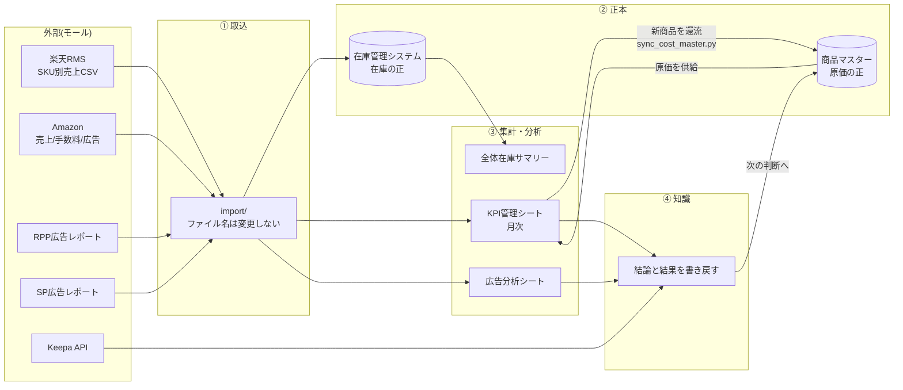

# MomijiStore_OS Logical Design v1.0

> **This document follows FOUNDATION.md.**
> **If any conflict exists, FOUNDATION.md takes precedence.**

ステータス: **ドラフト v1.0 — 承認待ち**
作成日: 2026-08-05
位置づけ: **Phase2「MomijiStore OS Core」最初の成果物**
階層: ARCHITECTURE層(`Architecture.md`の下位・実装の上位)

---

## 0. この文書の役割

`Architecture.md` が「会社を6層に分ける」ことを定めたのに対し、本書は **その6層の中身を論理として定義する**。

- **書くこと** — 何がデータなのか、どれが正本か、どの順に流れるか、誰が(何が)いつ触るか
- **書かないこと** — どのフォルダに置くか、どのコンテナで動かすか、どのマシンに載せるか(それは実装であり、本書の**結果**として決まる)

**Always Simple.** 本書は現行運用を否定せず、**すでに動いているものを論理として言語化する**ことを主眼とする。新しい概念は、必要になった時だけ足す。

### 前提(確定事項)

| 項目 | 確定値 |
|------|--------|
| NAS | UGREEN DXP4800 GT / Ryzen Embedded R2514 / RAM 8GB(増設予定) |
| ストレージ | M.2 SSD RAID1 約1.85TB |
| SMB | 接続確認済(SMB 3.1.1・Finderログイン項目で永続マウント) |
| Git | GitHub正本 → NASミラー(運用確認済) |
| 既存設計資産 | `01_InventoryManagement/docs/商品管理システム_DB設計書.md`(2026-06-28)— **本書はこれを継承する** |

---

## 1. 論理エンティティ — 会社を構成する「モノ」

会社の事実を7つのエンティティで表す。既存DB設計書の4テーブルを核とし、分析・知識の実態に合わせて3つを加えた。

| # | エンティティ | 意味 | 主キー | 状態 |
|---|-------------|------|--------|------|
| 1 | **商品**(`product_master`) | 売る対象そのもの | `internal_id`(`P000001`形式) | 既存設計あり・稼働中(962商品) |
| 2 | **仕入**(`purchase_order`) | 商品を仕入れた事実 | `purchase_id`(`PO-YYYYMMDD-001`) | 既存設計あり |
| 3 | **在庫**(`inventory`) | いま何がいくつあるか | `inventory_id`(`P000001-fba`) | 既存設計あり |
| 4 | **在庫異動**(`inventory_log`) | 在庫が動いた履歴 | 連番 | 既存設計あり(推奨扱い) |
| 5 | **販売**(`sales`) | 売れた事実(モール別・月次) | `internal_id` × チャネル × 年月 | **新規定義**(現在はKPIシートが担う) |
| 6 | **広告**(`ads`) | 広告費と成果(RPP / SP) | `internal_id` × チャネル × 年月 | **新規定義**(現在は分析シートが担う) |
| 7 | **知識**(`knowledge`) | 判断の理由と結果 | 文書ID | **新規定義**(Intelligence Layer) |

### 全エンティティを貫く原則

**`internal_id` が会社の背骨である。** 商品・仕入・在庫・販売・広告のすべてが `internal_id` で結ばれる。モール側のID(ASIN・楽天管理番号・SKU)は**外部識別子**であり、主キーにしない。モールが変わっても背骨は折れない。

**外部識別子の対応規則**(既存設計書より継承・変更しない):

| 識別子 | 格納先 | 規則 |
|--------|--------|------|
| 楽天商品管理番号(新形式・B始まり10桁) | `asin` | **ASINと同一値**のため一元管理。二重持ちしない |
| 楽天商品管理番号(旧形式・JAN/独自番号) | `rakuten_item_id` | `rakuten_item_id_type = 'old'` で識別 |
| 楽天SKU | `rakuten_sku` | **照合は「管理番号 × SKU」のペアで行う**(SKU単独は使い回しがあり不可) |
| Amazon FBA SKU | `amazon_sku_fba` | — |
| Amazon自己発送SKU | `amazon_sku_self` | 形式混在を許容 |

## 2. 正本(Single Source of Truth)の確定

**FOUNDATIONのPrinciple「記録されるか」とArchitectureの「正を1つだけ定める」に基づき、各データの正本をここで確定する。** 二重管理は事故の温床であり、正本が曖昧なデータは資産ではない。

| データ | **正本(確定)** | 派生(正本ではない) | 根拠 |
|--------|----------------|---------------------|------|
| 商品・**原価** | `商品マスター_単品_v1.0.xlsx` | KPIシートの仕入値・RMS埋め込み値 | 既存運用で確立済み。`sync_cost_master.py` が一方向同期を担う |
| 在庫 | **`在庫管理システム_v1.0.xlsm`** | `在庫管理テーブル_v1.1.xlsm`(作業用)・`全体在庫サマリー`(集計結果) | §2.1で確定 |
| 販売実績 | 各モールの元CSV(RMS / Amazon) | KPIシート月次タブ | モールのCSVが一次情報。シートは加工物 |
| 広告実績 | 各モールの広告レポート(CSV/XLSX) | RPP・SP分析シート | 同上 |
| 経費・限界利益 | KPIシート月次タブ(人が入力) | — | モールから取得できず、人の入力が一次情報 |
| 知識 | Git管理のMarkdown | — | Intelligence Layer |

### 2.1 在庫管理システムの正本 — 確定と、本番用xlsmの再判断

**確定: 在庫の正本は `MomijiStore_OS/01_InventoryManagement/Excel/在庫管理システム_v1.0.xlsm` とする。**

根拠は3点。(1) 2026-07-08更新で現存する唯一の稼働ファイルである。(2) VBAモジュール群(`Module_Inventory.bas` 等)が参照しているのは本ファイルである。(3) 現行の在庫更新パイプライン(楽天/Amazon CSV → リスト更新 → 単独シート → 全体サマリー)が本ファイル上で完結している。

**これに伴い、`在庫管理システム_v1.0_本番用.xlsm` の扱いを再判断する時点に到達した**(Decision Logの保留条件が満たされた)。

| 選択肢 | 評価 |
|--------|------|
| **A. 削除を確定する(推奨)** | 正本が`v1.0.xlsm`に確定した以上、`_本番用`は役割を終えている。6/28以降更新されておらず、内容もgit履歴(`cac3c98`)に完全保存されている。**ワークスペースから消えている現状をコミットで確定させるだけで、データは失われない** |
| B. 復元して別名保管 | `_backup/release/` へ退避する案。ただしgitに同一内容が残っており、二重保管になる |
| C. 保留継続 | 正本が確定した今、保留を続ける理由がなくなった |

**💡 A案を推奨するが、削除の確定は承認制のため実施しない。** ご判断をお願いします。

## 3. データフローの論理定義

現行運用を論理として記述する。**実装は変えず、順序と責任範囲を明文化する。**



### フローの規則

1. **取込ファイル名は変更しない**(モール由来CSVの照合互換を保つため — 既存ルール)
2. **原価は常に商品マスターから供給される。** KPIシートが原価を持つのは表示のためであり、正本ではない
3. **新商品の還流は一方向**(KPI → 商品マスター)。逆流(マスターをKPIで上書き)は禁止。原価不一致時は `sync_cost_master.py adopt` で**人が承認して**採用する
4. **未解決値は黄色で示す**(現行慣行)。黄色が残っている月は「未確定」であり、確定した月は塗りを解除する
5. **知識は必ず書き戻す。** 分析して終わりにしない(FOUNDATION AI Constitution 第8条)

## 4. 業務プロセスの論理設計

すべての業務は Automation Rule に従う。**現行の手作業も、同じ形に整理する。**

```
読む → 分析する → 提案する → 承認待ち → 実行する → Gitへ記録する
```

| プロセス | 頻度 | 現在の担い手 | 将来(Phase5)の担い手 | 人が承認する箇所 |
|----------|------|-------------|---------------------|-----------------|
| 在庫更新 | 随時 | 人+VBA | AI(ジョブ) | 差異が閾値を超えた時 |
| 月次KPI更新 | 月次 | 人+Python | AI(ジョブ) | 経費入力・原価不一致の採否 |
| 広告分析 | 月次 | 人+Python | AI(ジョブ) | 施策の採否 |
| 新商品のマスター還流 | 月次 | `sync_cost_master.py` | 同左(AIが起動) | 原価不一致の採用 |
| 商品リサーチ | 随時 | 人 | AI(Keepa+知識) | 仕入判断 |
| 設計変更 | 随時 | 人+Claude Code | 同左 | **常に必要** |

**人が承認する箇所には共通の性質がある — 金銭が動く、または後から戻せない。** この基準で承認ポイントを決め、それ以外は自動化してよい。

## 5. 知識(Intelligence)の論理設計

知識は「そのとき何を考えたか」を残すもので、データ(事実)とは別物である。

| 種別 | 何を書くか | 更新契機 |
|------|-----------|----------|
| 判断基準 | 仕入れる/やめる基準、価格改定の考え方 | 判断がぶれた時・新しい基準ができた時 |
| 施策の結論 | 何を試し、結果どうだったか(数値付き) | 施策の実施後・月次分析後 |
| モール仕様 | 楽天・Amazonの仕様と落とし穴 | 仕様変更に気づいた時(**1年で要再確認**) |
| 手順 | 運用マニュアル(OPERATIONS層) | 手順を変えた時 |
| 失敗 | やって駄目だったこと、その理由 | 失敗した時(**隠さない**) |

**知識には必ず記録日を付ける。** AI Memory Policy(`Architecture.md`)の寿命ルールを適用する。

## 6. Excel → Database 移行の論理(Phase4への橋渡し)

**移行は「作り直し」ではなく「移植」である**(CLAUDE.md方針)。列名・内部管理ID・マスター構造は変更しない。

| 段階 | 状態 | 正本の所在 |
|------|------|-----------|
| 現在 | Excel運用 | Excelファイル |
| 移行中 | Excel(正)+ DB(従・読み取り検証) | **Excel** |
| 移行後 | DB(正)+ Excel(表示・帳票) | **DB** |

**二重更新を防ぐため、正本の切替は一斉に行う。** 「一部だけDB」の状態を作らない。切替時はDecision Logへ記録する。

### 既存DB設計書との差分(要調整・Phase4で確定)

| 項目 | 既存設計書 | 本書/Architecture | 対応 |
|------|-----------|------------------|------|
| DBMS | MySQL想定のDDL | **PostgreSQL** | 型・構文の読み替えが必要(`DATETIME`→`TIMESTAMP`、`ON UPDATE CURRENT_TIMESTAMP`→トリガー等)。**列名`condition`が予約語に該当しないか要確認** |
| テーブル | 4テーブル | +販売・広告・知識 | Phase4で追加設計 |

**この差分は本書では解決しない。** Phase4(Database)で実装時に確定させる — 論理としては「既存設計を継承し、DBMS差異は移植時に吸収する」で足りる。

## 7. 論理設計の結果としてのフォルダ構成(提案)

**Rule: フォルダ構成は設計の結果であり、目的ではない。** 以下は§1〜§6の結果として導かれる案であり、**作成は承認後・Infrastructure実装開始条件の充足後**とする。

### NAS共有フォルダ `MomijiStore/`(命名規則はArchitecture.md準拠)

| フォルダ | 対応する層 | 用途 |
|----------|-----------|------|
| `10_Git/` | Infrastructure | GitHubのミラー(bare) |
| `20_Backup/` | Infrastructure | Mac資産のバックアップ・DBダンプ・世代管理 |
| `30_Data/` | Data | モール由来CSV・帳票の保管(取込元) |
| `40_Knowledge/` | Intelligence | 知識・分析結果・FAQ |
| `50_AIModels/` | Automation | Ollama等のモデル(HDD増設後に移設候補) |
| `90_System/` | Security/Infra | 復旧手順・NAS設定メモ・監査ログ |

※ 現状はM.2 SSDのみのため全フォルダがSSD上に載る。HDD増設後、`20_Backup/` `40_Knowledge/` `50_AIModels/` をHDDへ再配置する。

### リポジトリ側

現行の `MomijiStore_OS/01〜04` 構成は**変更しない**。既に業務単位で整理されており、変更コストに見合う利益がないため(Always Simple)。

## 8. Open Questions(次の判断が必要な事項)

| # | 事項 | 必要な判断 |
|---|------|-----------|
| 1 | **本番用xlsmの最終処遇** | §2.1のA/B/C(A推奨) |
| 2 | RAM増設の容量と時期 | Infrastructure実装開始条件 |
| 3 | HDD構成 | 同上 |
| 4 | 03_BrandReuseの論理設計 | ブランドリユース事業の開始時期が未定のため本書では枠のみ。事業開始時に追補 |
| 5 | メルカリの扱い | 現在は対象外。追加する場合はチャネルとして`inventory.channel`に追加するだけで済む設計になっている |

## 9. この設計が満たす完成条件

`Architecture.md` の Definition of Done に対する本書の寄与:

| DoD項目 | 本書での担保 |
|---------|-------------|
| 4. Git管理率100% | 正本をすべて特定した(§2)。Git外にある正本が無いことを確認できる |
| 7. 人が変わっても運営できる | 正本・フロー・承認点を文書化した。本書とOPERATIONS層で引き継ぎが成立する |
| 1〜3. AIによる分析・更新 | 承認点を明示した(§4)ことで、自動化してよい範囲が確定した |

---

**次のステップ:** 本書の承認 → §8-1(本番用xlsm)の判断 → Infrastructure実装開始条件(RAM・HDD)の充足 → フォルダ作成(Phase2後半)
