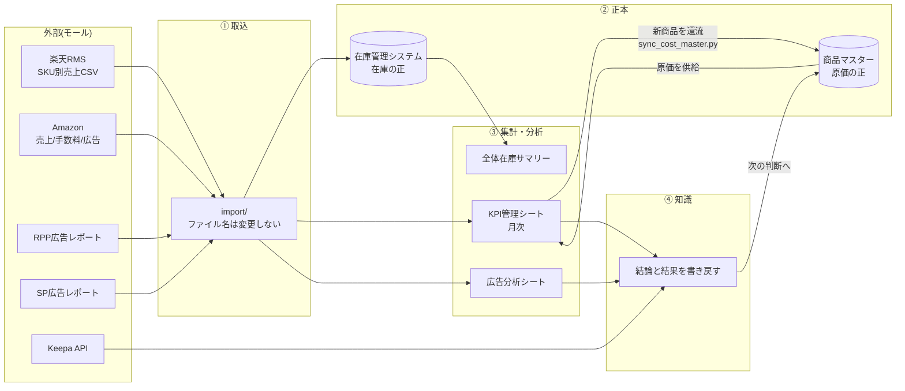

# MomijiStore_OS Logical Design v1.0

> **This document follows FOUNDATION.md.**
> **If any conflict exists, FOUNDATION.md takes precedence.**

ステータス: **v1.0 — 承認済み / Logical Design Complete(2026-08-05)**
作成日: 2026-08-05
位置づけ: **Phase2「MomijiStore OS Core」最初の成果物**
階層: ARCHITECTURE層(`Architecture.md`の下位・実装の上位)

---

## Design Principles(Phase2 全体の基本思想)

**この5原則が、Phase2「MomijiStore OS Core」のすべての判断を支配する。**

1. **論理設計は、実装方法を決める文書ではない。**
2. **論理設計は、会社の動きを定義する文書である。**
3. **Infrastructureは何度でも作り直せる。** NASもDockerもDBも、壊れたら作り直せばよい。交換可能なものに会社を縛らない
4. **Business Logicは作り直してはいけない。** 「利益をどう計算するか」「原価をどこで管理するか」は、作り直すたびに過去の数字と繋がらなくなる。**一度失うと復元できない**
5. **だから、Business Logicを最優先で設計する。**

**判断に迷ったときの順序:** Business Logic → データ構造 → 業務プロセス →(ここまでが本書)→ Infrastructure → 実装。
上から順に決める。逆順で決めると、道具の都合が会社の動きを歪める。

---

## 0. この文書の役割

`Architecture.md` が「会社を6層に分ける」ことを定めたのに対し、本書は **その6層の中身を論理として定義する**。

- **書くこと** — 何がデータなのか、どれが正本か、どの順に流れるか、誰が(何が)いつ触るか
- **書かないこと** — どのフォルダに置くか、どのコンテナで動かすか、どのマシンに載せるか(それは実装であり、本書の**結果**として決まる)

**Always Simple.** 本書は現行運用を否定せず、**すでに動いているものを論理として言語化する**ことを主眼とする。新しい概念は、必要になった時だけ足す。

### 前提(確定事項)

| 項目 | 確定値 |
|------|--------|
| NAS | UGREEN DXP4800 GT / Ryzen Embedded R2514 / RAM 8GB(増設予定) |
| ストレージ | M.2 SSD RAID1 約1.85TB |
| SMB | 接続確認済(SMB 3.1.1・Finderログイン項目で永続マウント) |
| Git | GitHub正本 → NASミラー(運用確認済) |
| 既存設計資産 | `01_InventoryManagement/docs/商品管理システム_DB設計書.md`(2026-06-28)— **本書はこれを継承する** |

---

## 1. Business Logic — 会社として絶対に守るルール

**この章には、100年変わらないものだけを書く。**

ExcelがDBになっても、MySQLがPostgreSQLになっても、NASが別の機械になっても、AIが別のAIになっても、**ここに書かれたことは変わらない**。逆に言えば、道具が変われば変わるようなことは、この章に書いてはならない。

### 判定基準 — この章に書いてよいか

> **「10年後、システムを全部作り直したとして、このルールはそのまま残るか?」**
> 残るなら Business Logic。残らないなら実装の話であり、別の章に書く。

### 1-1. お金のルール

| # | ルール |
|---|--------|
| BL-1 | **利益は商品マスターから計算する。** 原価の出所が複数あると、利益の数字が複数生まれる |
| BL-2 | **原価は商品マスターのみ変更可能。** 他のどこで原価を目にしても、それは表示であって変更してはならない |
| **BL-3** | **すべての経営判断は利益を最大化するために存在する。**<br>広告・価格改定・仕入・在庫管理・販売施策など、**すべての施策は利益を最大化するための手段**である。**売上は目的ではなく結果**であり、売上が増えても利益が減る施策は採用しない。利益率・利益額・回転率・キャッシュフロー・在庫効率を総合的に判断する。<br>**価格だけ・広告だけ・仕入だけという単独最適は行わない。会社全体の利益が最大になる選択を行う。**<br>**施策の評価範囲も会社全体とする。** 例えば広告は広告経由売上だけで評価せず、**オーガニック売上・利益額・キャッシュフロー**まで含めて評価する(広告は自然検索順位やオーガニック売上にも影響するため)。 |
| BL-4 | **仕入判断は利益率と回転率で行う。** どちらか一方では判断しない(高利益率でも売れなければ在庫、高回転でも薄利なら労働) |
| **BL-10** | **競争力は価格だけで決まらない。** Amazonにおける競争力は、**価格・配送速度・Prime対応・在庫状況・出品者品質**の総合評価で決まる。**価格競争だけを行うAIは作らない。** 利益を維持しながら、配送優位も利用してカートを獲得することを基本方針とする |

### 1-2. データのルール

| # | ルール |
|---|--------|
| BL-5 | **正本は各データにひとつだけ。増やしてはならない**(§3) |
| BL-6 | **承認無しで書き込み禁止。** 読むことは自由、書くことには承認が要る |
| BL-7 | **記録なき変更は認めない。** 誰が(何が)いつ何をなぜ変えたかが残らない変更は、無かったことにする |

### 1-3. 判断のルール

| # | ルール |
|---|--------|
| BL-8 | **AIは判断材料を提示するだけ。** 分析・比較・提案までがAIの領域 |
| BL-9 | **人が最終決定する。** AIの精度が上がっても、この境界は動かさない |
| **BL-11** | **「変更しない」も経営判断である。** 価格を据え置く・広告を維持する・仕入を見送る・在庫を追加しない —— これらはすべて立派な判断であり、記録の対象とする。**AIは「何をするか」だけでなく「なぜ今回は変更しないのか」まで説明できなければならない** |

**BL-8とBL-9は、FOUNDATION.md の AI Constitution 第1条と同一の思想である。** 本書で改めて書くのは、Business Logicとしても不変であることを示すため。

> **【BL番号について】** 番号は**安定した識別子**であり、章内の並び順を意味しない。
> 追加されたルール(BL-10・BL-11)は性質の合う節へ配置しているため、
> 節内の番号は連続しない。**既存の番号は再採番しない**(参照が壊れるため)。

---

## 2. 論理エンティティ — 会社を構成する「モノ」

会社の事実を7つのエンティティで表す。既存DB設計書の4テーブルを核とし、分析・知識の実態に合わせて3つを加えた。

| # | エンティティ | 意味 | 主キー | 状態 |
|---|-------------|------|--------|------|
| 1 | **商品**(`product_master`) | 売る対象そのもの | `internal_id`(`P000001`形式) | 既存設計あり・稼働中(962商品) |
| 2 | **仕入**(`purchase_order`) | 商品を仕入れた事実 | `purchase_id`(`PO-YYYYMMDD-001`) | 既存設計あり |
| 3 | **在庫**(`inventory`) | いま何がいくつあるか | `inventory_id`(`P000001-fba`) | 既存設計あり |
| 4 | **在庫異動**(`inventory_log`) | 在庫が動いた履歴 | 連番 | 既存設計あり(推奨扱い) |
| 5 | **販売**(`sales`) | 売れた事実(モール別・月次) | `internal_id` × チャネル × 年月 | **新規定義**(現在はKPIシートが担う) |
| 6 | **広告**(`ads`) | 広告費と成果(RPP / SP) | `internal_id` × チャネル × 年月 | **新規定義**(現在は分析シートが担う) |
| 7 | **知識**(`knowledge`) | 判断の理由と結果 | 文書ID | **新規定義**(Intelligence Layer) |

### 全エンティティを貫く原則

**`internal_id` が会社の背骨である。** 商品・仕入・在庫・販売・広告のすべてが `internal_id` で結ばれる。モール側のID(ASIN・楽天管理番号・SKU)は**外部識別子**であり、主キーにしない。モールが変わっても背骨は折れない。

**外部識別子の対応規則**(既存設計書より継承・変更しない):

| 識別子 | 格納先 | 規則 |
|--------|--------|------|
| 楽天商品管理番号(新形式・B始まり10桁) | `asin` | **ASINと同一値**のため一元管理。二重持ちしない |
| 楽天商品管理番号(旧形式・JAN/独自番号) | `rakuten_item_id` | `rakuten_item_id_type = 'old'` で識別 |
| 楽天SKU | `rakuten_sku` | **照合は「管理番号 × SKU」のペアで行う**(SKU単独は使い回しがあり不可) |
| Amazon FBA SKU | `amazon_sku_fba` | — |
| Amazon自己発送SKU | `amazon_sku_self` | 形式混在を許容 |

## 3. 正本(Single Source of Truth)の確定

**FOUNDATIONのPrinciple「記録されるか」とArchitectureの「正を1つだけ定める」に基づき、各データの正本をここで確定する。** 二重管理は事故の温床であり、正本が曖昧なデータは資産ではない。

### 鉄則 — 正本は増やしてはならない(BL-5)

**加工物は何枚あってもよい。正本は常にひとつだけ。**

```
売上CSV(正本)→ 加工シート → 分析シート → レポート
   ↑ ここだけが正本      ← これらは何枚存在してもよい
```

この考え方をすべてのデータへ適用する。

| 許されること | 許されないこと |
|-------------|---------------|
| 正本から**派生**を何枚でも作る | 正本を**2つ**にする |
| 派生を書き換える(再生成できるため) | 派生を書き換えて、それを正本として扱う |
| 正本を移す(Excel→DB等) | 移行の途中で**両方を正**として運用する |

**新しいファイル・シート・テーブルを作るとき、必ず問う — 「これは正本か、派生か」。** 答えられないものは作らない。派生であれば、**どの正本から生まれたかを必ず記す**。

正本を増やす変更(または移す変更)は**設計変更**であり、Decision Logへの記録と承認を要する。

| データ | **正本(確定)** | 派生(正本ではない) | 根拠 |
|--------|----------------|---------------------|------|
| 商品・**原価** | `商品マスター_単品_v1.0.xlsx` | KPIシートの仕入値・RMS埋め込み値 | 既存運用で確立済み。`sync_cost_master.py` が一方向同期を担う |
| 在庫 | **`SourceData/在庫管理テーブル_v1.1.xlsm`** | `全体在庫サマリー`(集計結果)・`Excel/在庫管理システム_v1.0.xlsm`(**サンプル入りプロトタイプ**) | §3.1で確定(2026-08-11訂正) |
| 販売実績 | 各モールの元CSV(RMS / Amazon) | KPIシート月次タブ | モールのCSVが一次情報。シートは加工物 |
| 広告実績 | 各モールの広告レポート(CSV/XLSX) | RPP・SP分析シート | 同上 |
| 経費・限界利益 | KPIシート月次タブ(人が入力) | — | モールから取得できず、人の入力が一次情報 |
| 知識 | Git管理のMarkdown | — | Intelligence Layer |

### 3.1 在庫管理システムの正本 — 確定と、本番用xlsmの再判断

**確定(2026-08-11 訂正): 在庫の正本は `MomijiStore_OS/01_InventoryManagement/SourceData/在庫管理テーブル_v1.1.xlsm` とする。**

根拠は3点。(1) 運用マニュアル全7文書とRULE 08が本ファイルを対象と明記している(2026-07-11整備)。(2) 棚卸確定の実装 `Module_InventoryOps.bas` が本ファイルを対象としている。(3) **実データを開いて確認した結果、554件の商品行を保持している**。

`Excel/在庫管理システム_v1.0.xlsm` は**サンプル入りのプロトタイプ**であり、業務データではない。**削除・移動はせず、前世代の設計プロトタイプとして現状のまま保管する。**

> **【訂正の経緯】** 当初(2026-08-05)、本節は在庫の正本を `Excel/在庫管理システム_v1.0.xlsm` と確定していた。その根拠3点はいずれも誤りまたは検証不足だった。
>
> | 当時の根拠 | 検証結果(2026-08-05 マニュアル照合 / 2026-08-11 実データ確認) |
> |---|---|
> | 「現存する唯一の稼働ファイル」 | **誤り** — `在庫管理テーブル_v1.1.xlsm` も現存し、より新しい(7/11) |
> | 「VBAが参照しているのは本ファイル」 | **不十分** — 実運用の中核である棚卸確定は `Module_InventoryOps` にあり、対象は在庫管理テーブル |
> | 「在庫更新パイプラインが本ファイル上で完結」 | **検証していない推測だった** |
>
> **決定打:** 実データを開いたところ、`在庫管理システム_v1.0.xlsm` の実データは**わずか2件**で、`P000001` が「ロイヤルカナン FCN キトン」となっており、**商品マスターの `P000001`(クリニーク アドベントカレンダー)と一致しない**。サンプルデータであることが確定した。
>
> 詳細な調査記録は `Phase3_Infrastructure_Plan.md` §15(OQ-7)を参照。

**これに伴い、`在庫管理システム_v1.0_本番用.xlsm` の保留条件が満たされ、✅ 削除確定(A案)が承認された**(2026-08-05)。

| 選択肢 | 評価 | 結果 |
|--------|------|------|
| **A. 削除を確定する** | `_本番用`は役割を終えている。6/28以降更新されておらず、内容もgit履歴(blob `cac3c98`)に完全保存されている ※当時の採用理由には「正本が`v1.0.xlsm`に確定したため」と記載していたが、これは上記の訂正対象。**削除という結論自体は変わらない**(サンプル入りプロトタイプのさらに古いコピーであるため) | **✅ 採用** |
| B. 復元して別名保管 | `_backup/release/` へ退避する案。ただしgitに同一内容が残っており二重保管になる | 不採用 |
| C. 保留継続 | 正本が確定した今、保留を続ける理由がない | 不採用 |

**削除確定の実体:** ワークスペースから消えている現状をコミットで確定させる操作であり、**内容はgit履歴に永続保存されるためデータは失われない**。必要になれば `git show cac3c98` でいつでも取り出せる。詳細はDecision Log参照。

## 4. データフローの論理定義

現行運用を論理として記述する。**実装は変えず、順序と責任範囲を明文化する。**



### フローの規則

1. **取込ファイル名は変更しない**(モール由来CSVの照合互換を保つため — 既存ルール)
2. **原価は常に商品マスターから供給される。** KPIシートが原価を持つのは表示のためであり、正本ではない
3. **新商品の還流は一方向**(KPI → 商品マスター)。逆流(マスターをKPIで上書き)は禁止。原価不一致時は `sync_cost_master.py adopt` で**人が承認して**採用する
4. **未解決値は黄色で示す**(現行慣行)。黄色が残っている月は「未確定」であり、確定した月は塗りを解除する
5. **知識は必ず書き戻す。** 分析して終わりにしない(FOUNDATION AI Constitution 第8条)

## 5. 業務プロセスの論理設計

すべての業務は Automation Rule に従う。**現行の手作業も、同じ形に整理する。**

```
読む → 分析する → 提案する → 承認待ち → 実行する → Gitへ記録する
```

| プロセス | 頻度 | 現在の担い手 | 将来(Phase5)の担い手 | 人が承認する箇所 |
|----------|------|-------------|---------------------|-----------------|
| 在庫更新 | 随時 | 人+VBA | AI(ジョブ) | 差異が閾値を超えた時 |
| 月次KPI更新 | 月次 | 人+Python | AI(ジョブ) | 経費入力・原価不一致の採否 |
| 広告分析 | 月次 | 人+Python | AI(ジョブ) | 施策の採否 |
| 新商品のマスター還流 | 月次 | `sync_cost_master.py` | 同左(AIが起動) | 原価不一致の採用 |
| 商品リサーチ | 随時 | 人 | AI(Keepa+知識) | 仕入判断 |
| 設計変更 | 随時 | 人+Claude Code | 同左 | **常に必要** |

**人が承認する箇所には共通の性質がある — 金銭が動く、または後から戻せない。** この基準で承認ポイントを決め、それ以外は自動化してよい。

## 6. 知識(Intelligence)の論理設計

知識は「そのとき何を考えたか」を残すもので、データ(事実)とは別物である。

| 種別 | 何を書くか | 更新契機 |
|------|-----------|----------|
| 判断基準 | 仕入れる/やめる基準、価格改定の考え方 | 判断がぶれた時・新しい基準ができた時 |
| 施策の結論 | 何を試し、結果どうだったか(数値付き) | 施策の実施後・月次分析後 |
| モール仕様 | 楽天・Amazonの仕様と落とし穴 | 仕様変更に気づいた時(**1年で要再確認**) |
| 手順 | 運用マニュアル(OPERATIONS層) | 手順を変えた時 |
| 失敗 | やって駄目だったこと、その理由 | 失敗した時(**隠さない**) |

**知識には必ず記録日を付ける。** AI Memory Policy(`Architecture.md`)の寿命ルールを適用する。

## 7. Excel → Database 移行の論理(Phase4への橋渡し)

**移行は「作り直し」ではなく「移植」である**(CLAUDE.md方針)。列名・内部管理ID・マスター構造は変更しない。

| 段階 | 状態 | 正本の所在 |
|------|------|-----------|
| 現在 | Excel運用 | Excelファイル |
| 移行中 | Excel(正)+ DB(従・読み取り検証) | **Excel** |
| 移行後 | DB(正)+ Excel(表示・帳票) | **DB** |

**二重更新を防ぐため、正本の切替は一斉に行う。** 「一部だけDB」の状態を作らない。切替時はDecision Logへ記録する。

### 既存DB設計書との差分(要調整・Phase4で確定)

| 項目 | 既存設計書 | 本書/Architecture | 対応 |
|------|-----------|------------------|------|
| DBMS | MySQL想定のDDL | **PostgreSQL** | 型・構文の読み替えが必要(`DATETIME`→`TIMESTAMP`、`ON UPDATE CURRENT_TIMESTAMP`→トリガー等)。**列名`condition`が予約語に該当しないか要確認** |
| テーブル | 4テーブル | +販売・広告・知識 | Phase4で追加設計 |

**この差分は本書では解決しない。** Phase4(Database)で実装時に確定させる — 論理としては「既存設計を継承し、DBMS差異は移植時に吸収する」で足りる。

## 8. 論理設計の結果としてのフォルダ構成(提案)

**Rule: フォルダ構成は設計の結果であり、目的ではない。** 以下は§2〜§7の結果として導かれる案であり、**作成は承認後・Infrastructure実装開始条件の充足後**とする。

### NAS共有フォルダ `MomijiStore/`(命名規則はArchitecture.md準拠)

| フォルダ | 対応する層 | 用途 |
|----------|-----------|------|
| `10_Git/` | Infrastructure | GitHubのミラー(bare) |
| `20_Backup/` | Infrastructure | Mac資産のバックアップ・DBダンプ・世代管理 |
| `30_Data/` | Data | モール由来CSV・帳票の保管(取込元) |
| `40_Knowledge/` | Intelligence | 知識・分析結果・FAQ |
| `50_AIModels/` | Automation | Ollama等のモデル(HDD増設後に移設候補) |
| `90_System/` | Security/Infra | 復旧手順・NAS設定メモ・監査ログ |

※ 現状はM.2 SSDのみのため全フォルダがSSD上に載る。HDD増設後、`20_Backup/` `40_Knowledge/` `50_AIModels/` をHDDへ再配置する。

### リポジトリ側

現行の `MomijiStore_OS/01〜04` 構成は**変更しない**。既に業務単位で整理されており、変更コストに見合う利益がないため(Always Simple)。

## 9. Open Questions(次の判断が必要な事項)

| # | 事項 | 必要な判断 |
|---|------|-----------|
| 1 | ~~本番用xlsmの最終処遇~~ | ✅ **解決済み** — A案(削除確定)を承認・実施(§3.1) |
| 2 | RAM増設の容量と時期 | Infrastructure実装開始条件 |
| 3 | HDD構成 | 同上 |
| 4 | 03_BrandReuseの論理設計 | ブランドリユース事業の開始時期が未定のため本書では枠のみ。事業開始時に追補 |
| 5 | メルカリの扱い | 現在は対象外。追加する場合はチャネルとして`inventory.channel`に追加するだけで済む設計になっている |

## 10. Phase2 Completion(Phase2 の完成条件)

**Phase2「MomijiStore OS Core」は、次の5条件をすべて満たした時に完成とする。**

| # | 条件 | 満たされたと言える状態 |
|---|------|----------------------|
| 1 | **会社の動きを誰でも説明できる** | 本書を読んだ人が、商品が仕入れられてから利益が出るまでを自分の言葉で説明できる |
| 2 | **実装方法を変更しても設計は変わらない** | ExcelをDBに替えても、NASを別機に替えても、本書の§1〜§7を書き直す必要がない |
| 3 | **AIが読める** | AIが本書だけを根拠に、正本・承認点・禁止事項を正しく判断できる |
| 4 | **人が読める** | 専門知識のない引き継ぎ先が、通読して業務の全体像を掴める |
| 5 | **5年後でも理解できる** | 当時の文脈を知らない読者でも、なぜそう決めたのかがDecision Logと合わせて追える |

**この5条件は、フォルダを作ったかどうかとは無関係である。** Phase2の完成は「構造物ができたこと」ではなく「**会社の動きが定義され、誰でも辿れるようになったこと**」で判定する。

## 11. Definition of Done への寄与

`Architecture.md` の Definition of Done(MomijiStore OS 1.0 完成条件)に対する本書の寄与:

| DoD項目 | 本書での担保 |
|---------|-------------|
| 4. Git管理率100% | 正本をすべて特定した(§3)。Git外にある正本が無いことを確認できる |
| 7. 人が変わっても運営できる | 正本・フロー・承認点を文書化した。本書とOPERATIONS層で引き継ぎが成立する |
| 1〜3. AIによる分析・更新 | 承認点を明示した(§5)ことで、自動化してよい範囲が確定した |

---

## 12. System Boundary(システム境界)

**MomijiStore OSが何を管理し、何を管理しないかを、ここで確定する。境界を曖昧にしない。**

境界が曖昧なシステムは、際限なく機能が流れ込み、やがて誰も全体を把握できなくなる。**管理しないと決めることは、管理すると決めることと同じだけ重要である。**

### 管理する(MomijiStore OSの内側)

| 対象 | 該当する層 |
|------|-----------|
| 商品 | Data |
| 在庫 | Data |
| 仕入 | Data |
| 販売 | Data |
| 広告 | Data |
| 利益 | Data(算出結果) |
| マスター | Data(正本) |
| 知識 | Intelligence |
| AI Memory | Intelligence |
| ログ(操作・変更・監査) | Security |

### 管理しない(MomijiStore OSの外側)

| 対象 | 理由 |
|------|------|
| 銀行 | 金銭の移動は人の責任領域。OSは記録も操作もしない |
| 会計ソフト | 会計は専門ソフトの領域。OSは数値を**渡すだけ** |
| 税務 | 制度対応は専門家の領域 |
| 給与 | 個人情報を含み、OSの目的外 |
| 契約書 | 法務の領域。OSは保管も管理もしない |
| 個人PC設定 | 個人の作業環境はOSの管理対象外 |

### 境界を越えるときの規則

1. **外側へは「出す」だけ。** 会計ソフトへ月次の集計値を渡すことはあっても、会計ソフトの内部をOSが持つことはしない
2. **外側のものをOSへ取り込まない。** 銀行残高や契約内容をデータとして保持しない
3. **境界の変更は設計変更である。** 外側にあるものを内側へ移す判断は、Decision Logへの記録と承認を要する
4. **迷ったら外側に置く。** 内側に入れるほど、引き継ぎ時に説明すべきことが増える(Always Simple)

## 13. Future Extension(将来の拡張予定)

**ここには「追加予定」だけを書く。設計は書かない。**
目的は、**今後どこまで拡張できる設計なのかを見えるようにする**こと。着手時期・優先度は未定であり、実際に着手する際は個別に設計・承認を行う。

### 事業の拡張

- BrandReuse OS
- Physical AI

### 販売チャネルの拡張

- Mercari
- Yahoo
- Shopify

### 機能の拡張

- CRM
- BI Dashboard
- Voice AI
- AI Agent
- Workflow Engine

---

**Phase2 ステータス: Logical Design Complete(2026-08-05)**

次は **Phase2.5「Business Catalog」**(`Business_Catalog.md`)— 会社の全業務の一覧化。
その後 **Phase3「MomijiStore OS Infrastructure」** — 共有フォルダの作成、Docker実行基盤、GitミラーNAS構築、バックアップ自動化。
Phase3の着手にはInfrastructure開始条件(RAM容量の確定・HDD構成の確定・Volume設計の確定)の充足が必要。
