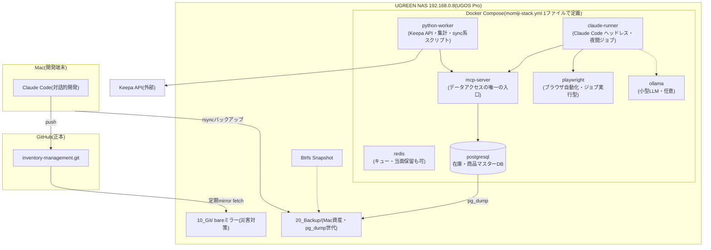

# MomijiStore NAS Infrastructure Phase1.5 — NAS接続確認 + 開発環境調査レポート

作成日: 2026-08-05(v1.0)
ステータス: **調査のみ実施(実装・設定変更は一切なし)**

凡例: 🔬=実機で確認した事実 / 📚=文献調査(実機未確認) / 💡=提案(承認待ち)

---

## 1. サマリー(結論)

| 項目 | 結果 |
|------|------|
| NAS到達性 | 🔬 **接続成功。** `192.168.0.8` にping応答(0.6ms)。同一LAN上に存在 |
| OS | 🔬 **UGOS Pro** を確認(= NASync DXPシリーズ)。管理画面 `:9999` 稼働中 |
| **SMB接続不可の原因** | 🔬 445/139がこのMacから到達不可であることを確認。**SMBサービスまたはアクセス制御の設定により445/TCPへ到達できていない可能性が高い。原因の特定は管理画面での確認が必要**(候補は§2) |
| Docker統合(最重要) | 📚 **可能。** UGOS ProはDocker + Docker Compose + Container Managerを標準搭載。AIスタックのCompose統合は現実的(§5) |
| Ollama | 📚 動作自体は可(CPU実行)。実用となるモデルサイズは**RAM容量確定後に再評価**(64GB増設なら7B〜14Bも視野) |
| ブロッカー | SMB開通(NAS側設定・ユーザー操作)と、NASモデル名・RAM・ストレージ構成の確認(管理画面ログインが必要) |

## 2. 接続確認の実測結果 🔬

| 確認項目 | 結果 |
|----------|------|
| ping 192.168.0.8 | ✅ 応答あり(0.6ms・パケットロス0%) |
| 80(HTTP) | ✅ OPEN → `:9999` へリダイレクト |
| 443(HTTPS) | ✅ OPEN |
| 9999(UGOS管理画面) | ✅ OPEN(`/desktop/?os=ugospro` — UGOS Pro確認) |
| 9443(UGOS HTTPS) | ✅ OPEN |
| **445(SMB)** | ❌ **closed/filtered** |
| **139(NetBIOS)** | ❌ closed/filtered |
| 22(SSH) | ❌ closed/filtered |

**診断:** NAS本体・ネットワークは正常。**SMBサービスまたはアクセス制御の設定により445/TCPへ到達できていない可能性が高い。原因の断定はできず、管理画面での確認が必要。** 考えられる要因:
1. SMBサービス自体が無効になっている
2. SMBが該当LANインターフェース(LAN1等)にバインドされていない
3. NASファイアウォールがSMBポートをブロックしている
4. Windows/Mac向けのアクセス制限(ホスト/ユーザー単位の許可設定)
5. サービスが有効設定でも実際には起動していない

**💡 確認手順(ユーザー操作・Phase2で実施):** UGOS Pro管理画面(`http://192.168.0.8:9999`)にログインし、上記1〜5を順に確認 →(必要なら)SMBサービス有効化・バインド先確認・ファイアウォールでLAN内(192.168.0.0/24)の445を許可。
※ 管理画面へのログインはユーザー自身が実施してください(Claudeは認証情報を扱いません)。設定変更自体も承認制のため、Claudeは実施しません。

## 3. 開発環境調査(①〜⑬) 📚

| # | 項目 | 調査結果 |
|---|------|----------|
| ① | Docker運用可否 | **可。** UGOS ProはApp CenterからDockerを標準提供(手動インストール不要)。DXPシリーズ全般で対応 |
| ② | Container Manager | **あり。** Compose画面で `docker-compose.yml` を貼り付けてデプロイ可能。視覚管理が欲しければPortainer併用も可(ただし§6のシンプル原則により、まずは標準Container Managerのみを推奨) |
| ③ | Git Server構築 | 2案。**A案(推奨💡): bareミラーのみ** — 共有フォルダに `git clone --mirror` を置き、定期fetchで同期。サーバー常駐なし・最シンプル。**B案: Giteaコンテナ** — Web UI付きGitサーバー。高機能だが運用対象が増える。正本はGitHubのため、災害対策目的ならA案で十分 |
| ④ | Claude Code実行 | **可(ヘッドレス)。** Claude CodeはLinux CLIとしてコンテナ内で動作可能。定期ジョブ(夜間バッチ)としての利用が現実的。認証(APIキー)の安全な管理方法はPhase4設計時に決定。対話的開発は引き続きMacで行う |
| ⑤ | MCP Server構築 | **可。** MCPサーバーはNode/Pythonプロセスとしてコンテナ化可能。在庫DB(PostgreSQL)への読み書きをMCP経由に統一すると、Claude Code/他AIから同じ入口でアクセスできる |
| ⑥ | Playwright | **可。** 公式Dockerイメージあり。楽天/Amazonの画面取得等の自動化に使用可。メモリ消費が大きい(1タブ数百MB)ため常駐ではなくジョブ実行型を推奨 |
| ⑦ | Python | **可。** 公式イメージで任意バージョンを固定可能。現行の `sync_cost_master.py` 等はほぼそのまま移植可能 |
| ⑧ | PostgreSQL | **可。** 公式イメージで安定運用可。在庫管理・商品マスターのDB化の受け皿。データは専用Volumeに配置(§4) |
| ⑨ | Redis | **可。** 軽量。ジョブキュー・キャッシュ用。**当面は不要の可能性あり**(シンプル原則 — PostgreSQLだけで足りる規模の間は導入を保留する選択肢を推奨) |
| ⑩ | Ollama | **動作可(CPU実行)。実用モデルサイズは RAM容量確定後に再評価。** 参考: 8GB機では3B級が上限気味だが、DXP4800 Plus系で64GBまで増設すれば7B〜14Bも現実的になる。モデル名・RAM(増設予定含む)の確定を待って判断する |
| ⑪ | バックアップ方式 | UGOS Pro標準のバックアップツールあり(ローカル/クラウド/PCクライアント)。Mac→NASは `rsync` over SMB/SSHが最シンプル。詳細設計はPhase3 |
| ⑫ | Snapshot | **あり。** Btrfsスナップショットによる時点復元をサポート(ファイルシステムがBtrfsであることが前提 — 実機確認必要) |
| ⑬ | AI Agent構成 | 上記を組み合わせた全体像は§5の構成図参照。「MCPを唯一のデータ入口にする」ことがAIが運営できる会社の土台になる |

## 4. Storage Architecture(⑭〜㉓)

**⚠️ 実機のRAID/Volume構成は管理画面ログインが必要なため未確認。** 以下は📚文献+💡設計提案。Phase2冒頭にユーザーと管理画面を見ながら現状を確定させる。

| # | 項目 | 調査結果・提案 |
|---|------|----------------|
| ⑭ | RAID構成 | UGOS ProはRAID 0/1/5/6/10・JBODに対応。💡2ベイ機ならRAID1、4ベイ以上ならRAID5を推奨(要現状確認) |
| ⑮ | Volume設計 | 💡Volume1(HDD/RAID): 共有データ・バックアップ・Git。Volume2(M.2 SSDがあれば): Docker・DB用。**要確認: 現在のVolume構成・空き容量** |
| ⑯ | Snapshot設計 | 💡Btrfs前提で、共有フォルダ単位のスケジュールSnapshot(daily×7 / weekly×4)。DBはSnapshotではなく`pg_dump`で世代管理(整合性のため) |
| ⑰ | SSD Cache | DXPシリーズはM.2スロット搭載機が多く、NVMe SSDをキャッシュまたは独立Volumeとして使用可。💡キャッシュよりも「Docker/DB専用Volume」としての利用を推奨(効果が読みやすくシンプル) |
| ⑱ | Docker保存場所 | 💡SSD Volume(あれば)に `docker/` を配置。イメージ・コンテナレイヤをHDDから分離しI/O競合を防ぐ |
| ⑲ | Git保存場所 | 💡HDD Volume `10_Git/inventory-management.git`(bareミラー)。書き込み頻度が低いためHDDで十分 |
| ⑳ | PostgreSQL保存場所 | 💡SSD Volume(あれば)。`pg_dump` の出力先はHDD側 `20_Backup/db/` |
| ㉑ | AIモデル保存場所 | 💡HDD Volume `50_AIModels/`(Ollamaモデルは数GB〜。読み込みは起動時のみなのでHDDで許容) |
| ㉒ | バックアップ保存場所 | 💡HDD Volume `20_Backup/`(Mac資産・DBダンプ・設定エクスポート)。将来的にNAS外(クラウドS3互換等)への第2バックアップをPhase4で検討 |
| ㉓ | 8TB追加時の拡張 | RAID1運用なら「両ディスクを順次大容量へ交換→再構築→拡張」、空きベイがあれば「新ディスク追加で新Volume作成」が最も安全(既存Volumeに触れない)。💡空きベイ方式を推奨。**要確認: ベイ数と空き状況** |

## 5. AI Infrastructure — Docker Compose統合(㉔・最重要)

### 結論

**Claude Code / MCP / Playwright / Keepa / Python / Ollama / Redis / PostgreSQL のDocker Compose統合は可能**、かつUGOS ProのContainer Managerは `docker-compose.yml` をそのまま受け付けるため、**1ファイル=会社のインフラ定義**という理想形を実現できる。
※ KeepaはAPIサービスなのでコンテナではなく「Pythonワーカーから呼ぶ外部API」として統合する。

### 構成図

### メリット

1. **インフラ全体が1つのYAMLで再現可能** — NAS故障時も新機材+同じComposeファイルで復元できる。「会社をプロダクト化する」思想と直結し、売却時の引き継ぎ資料そのものになる
2. **サービス間の依存が明示される**(depends_on)— 属人知識がコードになる
3. **個別更新が安全** — コンテナ単位で更新・ロールバックでき、他へ影響しない
4. **Macへの依存が消える** — 夜間バッチ・定期集計がMacの電源状態と無関係に回る
5. Container Manager標準機能で管理でき、追加ツールが不要

### デメリット・リスク

1. **運用スキルの前提が上がる** — Docker/Composeの基礎知識が引き継ぎ要件になる(→ 対策: `90_System/` に復旧手順書を必ず整備)
2. **NASのCPU/RAM制約** — 全コンテナ常駐は過剰。Ollama・Playwrightは重い(→ 対策: 常駐はPostgreSQL+MCPのみ、他はジョブ実行型にする)
3. **UGOSアップデートでDocker環境が影響を受ける可能性**(→ 対策: Snapshot+Composeファイルのgit管理で復元可能にしておく)
4. Claude Codeの認証情報管理に設計が必要(→ Phase4で secrets 管理方針を決定)

### 💡 シンプル原則に基づく段階導入案

全部を一度に立てない。**Phase4で PostgreSQL + MCP + python-worker の3つだけから始め**、動いてから claude-runner → Playwright → Ollama の順に追加する。RedisはキューがPostgreSQLで捌けなくなってから導入する。

## 6. ユーザーへの確認事項(Phase2前)

1. **NASのモデル名**(DXP2800/4800/4800 Plus等)と**RAM容量** — 管理画面またはNAS本体で確認できます。Ollama可否・常駐構成の設計に必須
2. **SMB開通の承認** — §2の解決手順(ファイアウォールでSMB許可)をユーザー操作で実施してよいか。実施後、共有フォルダ調査(Phase1②の残り)を完了させます
3. **管理画面で確認したいこと**(ユーザーと一緒に見る or スクリーンショット提供): RAID構成 / Volume構成と空き容量 / ファイルシステム(Btrfsか) / M.2 SSD有無 / 空きベイ数
4. 本レポートの承認・コミット可否

---

### 参考文献(📚項目の出典)

- [UGREEN公式: NAS Apps & Software(UGOS Pro/Docker/VM)](https://ai.ugreen.com/pages/solution-software)
- [UGREEN公式: Docker and Docker Compose on UGREEN NAS](https://ai.ugreen.com/blogs/knowledge/docker-docker-compose-ugreen-nas)
- [Docker on UGREEN NAS: Setup Guide(Need to Know IT)](https://needtoknowit.com.au/blog/ugreen-nas-docker-containers-guide/)
- [UGOS Pro Review 2026(Need to Know IT)](https://needtoknowit.com.au/blog/ugreen-ugos-pro-review-nas-software-and-ecosystem-explained/)
- [UGREEN DXP4800 Pro Review(TechTimes)](https://www.techtimes.com/articles/318883/20260623/ugreen-dxp4800-pro-nas-review-new-flagship-nas-10gbe-144tb-capacity-that-outperforms-its-rivals.htm)
- [Running AI on my NAS at 5 tokens/sec(XDA)](https://www.xda-developers.com/running-ai-on-nas-5-tokens-per-second/)
- [Ollama on Intel N100/N150(Hobbyist's Hideaway)](https://bishalkshah.com.np/blog/ollama-n100-mini-pc-local-ai)
- [UGREEN DXP6800 Pro notes(GitHub TheLinuxGuy)](https://github.com/TheLinuxGuy/ugreen-nas)
