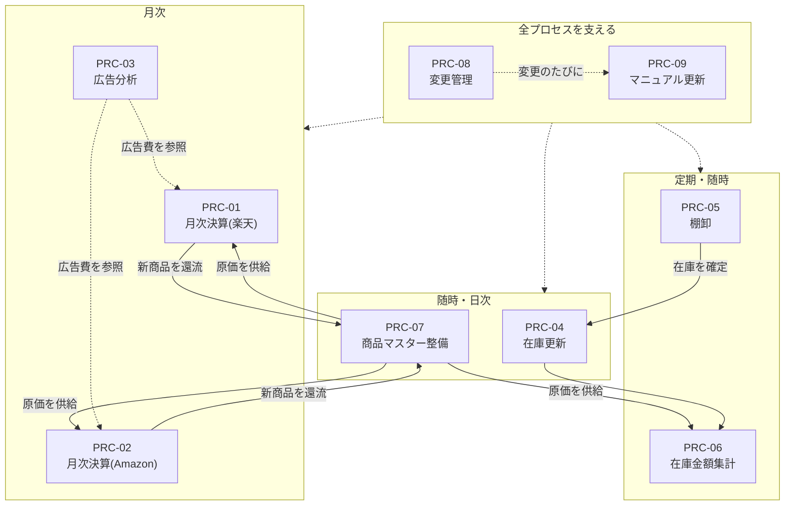
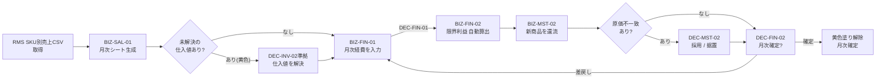
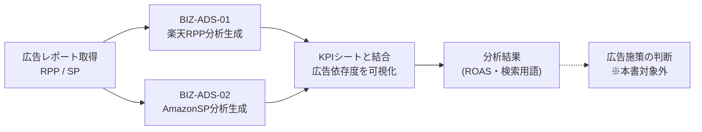
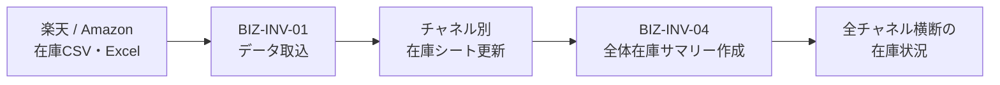
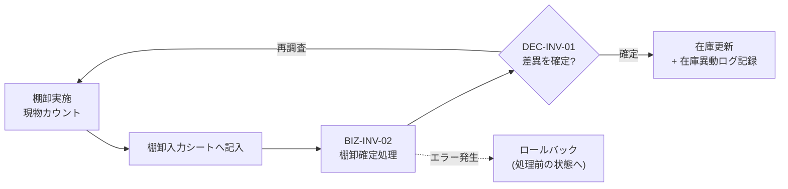
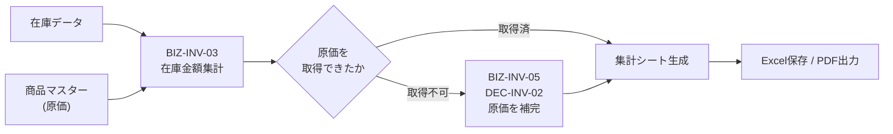
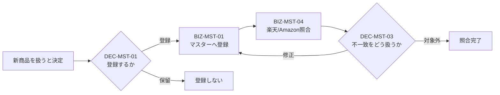
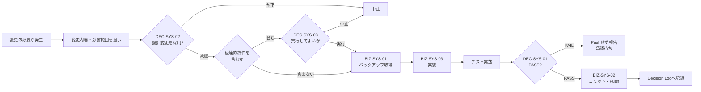
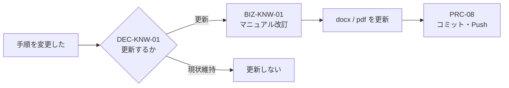

# Process_Catalog — もみじストア 業務フロー一覧

> **This document follows FOUNDATION.md.**
> **If any conflict exists, FOUNDATION.md takes precedence.**

ステータス: **ドラフト v1.0 — 承認待ち**
作成日: 2026-08-05
位置づけ: **Phase2.5「Business Catalog」第3成果物**
階層: ARCHITECTURE層(`Business_Catalog.md` / `Decision_Catalog.md`と同階層)

---

## 0. この文書の役割

**業務(Business)と判断(Decision)を、実際の仕事の流れとして接続する。**

これまでの3文書はそれぞれ独立した一覧だった。本書がそれらを繋ぐ。

```
Business Logic(絶対のルール)
        ↓ 支配する
Process(仕事の流れ)  ← 本書
        ↓ 構成する
Business(個々の業務)   Decision(個々の判断)
```

**なぜ接続が必要か:** 業務単体では自動化できない。「在庫CSVを取り込む」だけでは仕事は終わらず、取込→更新→集計→確定という**流れ全体**が回って初めて仕事になる。Infrastructureが支えるべきはこの流れである。

### 作成方針 — 推測を書かない

**`Business_Catalog.md` の🔬確認済21業務と `Decision_Catalog.md` の11判断のみで構成する。** 💡推定業務は一切使わない。各プロセスの例外処理も、コード・手順書に実在する処理のみを記載する。

### Process ID規則

`PRC-<連番2桁>` — 領域をまたぐため領域記号は付けない。
※ 命名規則本体は `Architecture.md` の Naming Convention に登録済み。

---

## 1. 全体マップ — プロセスの関係と周期



**この図が示す最重要の構造:** `PRC-07(商品マスター整備)`が全プロセスへ原価を供給し、月次決算から新商品が還流する。**このループが会社の利益計算の心臓部**であり、Business Logic BL-1・BL-2が守っているのはこの一点である。

---

## 2. プロセス定義

### PRC-01 月次決算プロセス(楽天)



| 項目 | 内容 |
|------|------|
| **開始条件** | 対象月が終了し、RMSからSKU別売上CSVを取得できる状態 |
| **終了条件** | 黄色セルが残っておらず、限界利益が確定し、月次確定(塗り解除)が完了 |
| **入力** | RMS SKU別売上CSV、商品マスター(原価)、月次経費の実額 |
| **出力** | KPI管理シート月次タブ(確定済)、商品マスターへの新商品登録 |
| **関連Business ID** | BIZ-SAL-01, BIZ-FIN-01, BIZ-FIN-02, BIZ-FIN-03, BIZ-MST-02, BIZ-MST-03 |
| **関連Decision ID** | DEC-FIN-01, DEC-FIN-02, DEC-MST-02 |
| **Business Logic** | BL-1(利益は商品マスターから計算), BL-2(原価はマスターのみ変更可), BL-5(正本は増やさない) |
| **担当** | 人 + Python(`build_kpi_month.py`, `sync_cost_master.py`) |
| **AI関与** | シート生成・突合・差分提示は完全に任せられる。経費額と確定可否の判断は不可 |
| **承認** | **要**(2箇所)— 月次経費の計上額、月次確定の可否 |
| **例外処理** | ①仕入値が未解決の行は**黄色で可視化**し、解決するまで確定しない ②生成後にCSV合計との突合を自動実行(`build_kpi_month.py`)。不一致なら確定せずDEC-FIN-02で差戻す ③生成前にバックアップを自動取得 |

### PRC-02 月次決算プロセス(Amazon)


| 項目 | 内容 |
|------|------|
| **開始条件** | 対象月が終了し、Amazon売上データとトランザクションレポートを取得できる状態 |
| **終了条件** | 実額手数料が反映され、限界利益が確定し、月次確定が完了 |
| **入力** | Amazon売上データ、トランザクションレポート、商品マスター(原価)、月次経費 |
| **出力** | Amazon KPI管理シート月次タブ(確定済)、商品マスターへの新商品登録 |
| **関連Business ID** | BIZ-SAL-02, BIZ-SAL-03, BIZ-FIN-01, BIZ-FIN-02, BIZ-FIN-03, BIZ-MST-02, BIZ-MST-03 |
| **関連Decision ID** | DEC-FIN-01, DEC-FIN-02, DEC-MST-02 |
| **Business Logic** | BL-1, BL-2, BL-5 |
| **担当** | 人 + Python(`build_amazon_kpi_month.py`, `apply_amazon_fees.py`, `sync_cost_master.py`) |
| **AI関与** | PRC-01と同じ(生成・反映・突合は可、判断は不可) |
| **承認** | **要**(2箇所)— 月次経費、月次確定 |
| **例外処理** | **手数料は見積値ではなく実額で上書きする**(`apply_amazon_fees.py`)。トランザクションレポート未取得の月は実額反映を保留し、確定しない |

### PRC-03 月次広告分析プロセス



| 項目 | 内容 |
|------|------|
| **開始条件** | 対象月の広告レポート(RPP / SP・検索用語)を取得できる状態 |
| **終了条件** | 分析シートが生成され、ROASと広告依存度が算出された状態 |
| **入力** | RPP広告レポートCSV、SP広告レポート・検索用語レポート、KPIシート(売上) |
| **出力** | 楽天RPP広告分析シート、AmazonSP広告分析シート |
| **関連Business ID** | BIZ-ADS-01, BIZ-ADS-02 |
| **関連Decision ID** | **なし**(§4参照) |
| **Business Logic** | BL-3(広告は利益を増やすために存在する) |
| **担当** | Python(`build_rakuten_rpp_month.py`, `build_amazon_sp_month.py`) |
| **AI関与** | **生成から分析まで完全に任せられる**(確定を伴わないため) |
| **承認** | 不要(分析結果の生成まで) |
| **例外処理** | 広告レポートの期間がKPIシートの対象月と一致しない場合、結合しない |

> ⚠️ **このプロセスは判断で終わっていない。** BL-3が求める「利益が減る広告は止める」という判断(継続/停止/入札変更)は、出典業務が💡推定のため本書に含めていない。**Business Catalogの確認後、本プロセスの終了条件を「施策を決定した状態」へ改める必要がある。**

### PRC-04 在庫更新プロセス



| 項目 | 内容 |
|------|------|
| **開始条件** | モールから在庫データを取得した時(随時) |
| **終了条件** | 全体在庫サマリーが最新化された状態 |
| **入力** | 楽天/Amazon 在庫CSV・Excel |
| **出力** | チャネル別在庫シート、全体在庫サマリー |
| **関連Business ID** | BIZ-INV-01, BIZ-INV-04 |
| **関連Decision ID** | なし(取込と集計のみで確定を伴わない) |
| **Business Logic** | BL-5(正本は増やさない — サマリーは派生であり正本ではない) |
| **担当** | VBA(`CsvImport`)+ 人(Excel) |
| **AI関与** | **完全に任せられる** |
| **承認** | 不要 |
| **例外処理** | 取込時に列マッピングを検証(`MapColumns`)。想定列が見つからない場合は取込を中止する |

### PRC-05 棚卸プロセス



| 項目 | 内容 |
|------|------|
| **開始条件** | 棚卸を実施し、現物カウント結果が揃った状態 |
| **終了条件** | 在庫が確定し、在庫異動ログに記録された状態 |
| **入力** | 棚卸入力シート(現物数)、帳簿在庫 |
| **出力** | 確定在庫、在庫異動ログ(バッチID付き) |
| **関連Business ID** | BIZ-INV-02 |
| **関連Decision ID** | DEC-INV-01 |
| **Business Logic** | BL-6(承認無しで書き込み禁止), BL-7(記録なき変更は認めない) |
| **担当** | 人 + VBA(`ConfirmInventory`) |
| **AI関与** | 差異の算出・異常値の指摘は可。**差異を確定する判断は不可** |
| **承認** | **要** — 差異の確定 |
| **例外処理** | **処理中にエラーが発生した場合はロールバックし、処理前の状態へ戻す**(`ConfirmInventory`にエラーハンドラとロールバックが実装済) |

### PRC-06 在庫金額集計プロセス



| 項目 | 内容 |
|------|------|
| **開始条件** | 在庫データが最新化され、金額評価が必要になった時 |
| **終了条件** | 在庫金額集計シートが生成され、Excel/PDFとして保存された状態 |
| **入力** | 在庫データ、商品マスター(原価) |
| **出力** | 在庫金額集計シート、チェックシート、PDF |
| **関連Business ID** | BIZ-INV-03, BIZ-INV-05 |
| **関連Decision ID** | DEC-INV-02 |
| **Business Logic** | BL-1(利益は商品マスターから計算), BL-2(原価はマスターのみ変更可) |
| **担当** | VBA(`RunAggregation`, `SaveExcel`, `SavePDF`)+ 人 |
| **AI関与** | 集計と候補提示は可。**補完値を決める判断は不可** |
| **承認** | **要** — 原価の補完値 |
| **例外処理** | ①原価はJAN→管理番号の順で検索(`FindCostInMaster` → `FindCostByManageNo`)。どちらでも取得できない行はチェックシートへ分離 ②セットSKU・アスト品は専用判定で数量換算(`IsSetSku`, `ExtractSetQty`) |

### PRC-07 商品マスター整備プロセス



| 項目 | 内容 |
|------|------|
| **開始条件** | 新商品を扱うと決めた時、または識別子の不整合が判明した時 |
| **終了条件** | `internal_id` が採番され、外部識別子(ASIN・楽天管理番号・SKU)が正しく対応付いた状態 |
| **入力** | 商品情報(名称・JAN・ASIN・SKU・原価)、モール商品一覧 |
| **出力** | 商品マスター行、照合結果ファイル |
| **関連Business ID** | BIZ-MST-01, BIZ-MST-04 |
| **関連Decision ID** | DEC-MST-01, DEC-MST-03 |
| **Business Logic** | BL-2(原価はマスターのみ変更可), BL-5(正本は増やさない) |
| **担当** | 人 + Excel |
| **AI関与** | 重複検出・照合・差分抽出は可。**登録可否と不一致の扱いの判断は不可** |
| **承認** | **要**(2箇所)— 登録可否、不一致の扱い |
| **例外処理** | 楽天新形式(B始まり10桁)はASINと同一値のため `asin` に一元格納し、旧形式のみ `rakuten_item_id` に格納する(二重持ちを禁止)。**照合は「管理番号 × SKU」のペアで行う**(SKU単独は使い回しがあるため不可) |

### PRC-08 変更管理プロセス(システム)



| 項目 | 内容 |
|------|------|
| **開始条件** | 設計・構成・Docker・フォルダ・DBのいずれかを変更する必要が生じた時 |
| **終了条件** | 変更が実装され、テストPASSし、GitHubへ反映され、Decision Logへ記録された状態 |
| **入力** | 変更提案(内容・理由・代替案・影響範囲) |
| **出力** | 実装済みの変更、コミット、Decision Log行 |
| **関連Business ID** | BIZ-SYS-01, BIZ-SYS-02, BIZ-SYS-03 |
| **関連Decision ID** | DEC-SYS-01, DEC-SYS-02, DEC-SYS-03 |
| **Business Logic** | BL-6(承認無しで書き込み禁止), BL-7(記録なき変更は認めない), BL-8・BL-9(AIは材料提示、人が決定) |
| **担当** | 人 + Claude Code |
| **AI関与** | 提案・代替案提示・影響分析・実装・テストは可。**採用可否と破壊的操作の可否は不可** |
| **承認** | **要**(最大3箇所)— 設計変更の採否、破壊的操作の可否、Pushの可否 |
| **例外処理** | **テストがFAILの場合はPushせず、原因・影響範囲・修正案を報告して承認を待つ**(`CLAUDE.md` 作業完了時の標準フロー) |

### PRC-09 マニュアル更新プロセス



| 項目 | 内容 |
|------|------|
| **開始条件** | 運用手順を変更した時 |
| **終了条件** | マニュアルが改訂され、Gitへ記録された状態 |
| **入力** | 変更内容 |
| **出力** | 改訂済マニュアル(OPERATIONS層) |
| **関連Business ID** | BIZ-KNW-01 |
| **関連Decision ID** | DEC-KNW-01 |
| **Business Logic** | BL-7(記録なき変更は認めない) |
| **担当** | 人 |
| **AI関与** | 草案作成・影響箇所の指摘は可。**更新可否の判断は不可** |
| **承認** | **要** — 更新内容 |
| **例外処理** | docxとpdfの両形式を維持する(現行運用で7文書すべてが両形式で存在) |

---

## 3. カバレッジ検証

**確認済21業務・11判断がすべてプロセスに接続されているか:**

| 対象 | 総数 | プロセスへ接続済 | 未接続 |
|------|------|-----------------|--------|
| 🔬確認済業務 | 21 | **21** | 0 |
| 判断(Decision) | 11 | **11** | 0 |

**漏れなく接続された。** 逆に言えば、**確認済の業務のうち、どのプロセスにも属さない孤立した業務は存在しない**。

### プロセスの性質

| 指標 | 値 |
|------|-----|
| プロセス総数 | **9件** |
| 人の承認を含むプロセス | **7件**(PRC-01, 02, 05, 06, 07, 08, 09) |
| AIに完全に任せられるプロセス | **2件**(PRC-03 広告分析, PRC-04 在庫更新)— どちらも**確定を伴わない** |
| 例外処理がコードとして実装済 | **4件**(PRC-01 突合・自動バックアップ / PRC-04 列マッピング検証 / PRC-05 ロールバック / PRC-06 原価フォールバック検索とチェックシート分離) |
| 例外処理が規約・運用慣行で担保 | 5件(PRC-02, 03, 07, 08, 09) |

**Decision Catalogで発見した「確定を伴わない作業はAIに任せてよい」という境界が、プロセス単位でも成立している。** AIに完全委譲できるPRC-03とPRC-04は、いずれも生成・集計のみで確定を含まない。

## 4. 本書に含めなかったプロセス(意図的な除外)

| 除外したプロセス | 理由 |
|-----------------|------|
| 仕入プロセス(リサーチ→仕入判断→発注→入荷検品) | 構成業務 BIZ-PUR-01〜04 がすべて💡推定。**BL-4に対応する中核プロセスであり、業務確認後に最優先で追加する** |
| 販売プロセス(出品→受注→出荷) | 構成業務 BIZ-SAL-04, 06 が💡推定 |
| 価格改定プロセス | 構成業務 BIZ-SAL-05 が💡推定 |
| 広告施策プロセス(PRC-03の続き) | 構成業務 BIZ-ADS-03, 04 が💡推定。**PRC-03が判断で終わっていない原因** |
| 顧客対応プロセス | 構成業務 BIZ-SAL-07 が💡推定 |

## 5. Open Questions

| # | 事項 | 必要な対応 |
|---|------|-----------|
| 1 | 除外した5プロセス | `Business_Catalog.md` の💡16件確認後に追加 |
| 2 | PRC-03の終了条件 | 広告施策の判断を含む形へ改める(業務確認後) |
| 3 | PRC-01とPRC-02の統合可否 | 楽天とAmazonで手順がほぼ同一。将来DB化(Phase4)時に1プロセスへ統合できるか検討 |
| 4 | 在庫更新(PRC-04)と棚卸(PRC-05)の関係 | 棚卸確定がPRC-04のどの時点に入るか、実運用の順序を確認 |

---

**次のステップ:** 本書の承認 → `Business_Catalog.md` §10の確認(💡16件)→ 3カタログへの追補 → **Phase3「MomijiStore OS Infrastructure」**
